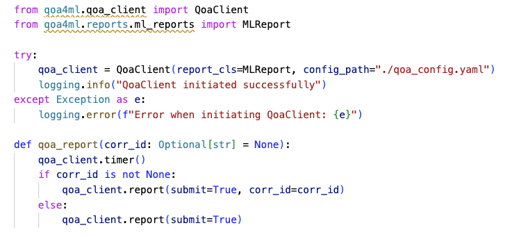
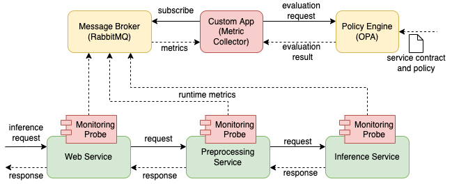

# ML Monitoring tutorial

## Study goal
The purpose of this tutorial is to learn: 
- Implementing end-to-end monitoring of machine learning (ML) serving.
- Evaluating performance of the ML services in real-time supporting runtime explainability.

## Prerequisite
* [Docker](https://docs.docker.com/get-docker/)
* [Kubernetes](https://kubernetes.io/) or [Minikube](https://minikube.sigs.k8s.io/docs/)
* [Open Policy Agen - OPA](https://www.openpolicyagent.org/)
* [Qoa4ML](https://github.com/rdsea/QoA4ML)
* [End-to-end ML Application](https://github.com/rdsea/sys4bigml/tree/master/tutorials/MLServing)


## Integrate Monitoring Probes
***Note*** *This tutorial will follow the previous tutorial on [ML Serving](https://github.com/rdsea/sys4bigml/tree/master/tutorials/MLServing)*

As in the previous tutorial, we already implement an end-to-end ML application including 3 microservices: Web service, Preprocessing service, and Inference services. 
Now, we're going to integrate monitoring probes from the QoA4ML library in to the source code of these microservices to collect runtime metrics

In the source code we already help you initiate an `qoa_client` to report the response time of each inference request from the three microservices. Your work includes: 
- Decide which metrics to measure and report (in addition to response time).
- Use the `qoa_client` to report the metrics.

***Hint***: you can create a report as a python dictionary and use `qoa_client.report(report=<your report>, submit=True)` to report multiple metrics in your schema. Alternatively, you can use the `qoa_client.observe_metric(<metric name (str)>, <value>)` function to add a metric with it value to the report (in default schema of QoA4ML) and send the report by calling `qoa_client.report(submit=True)`.

<p align = "center">

</p> 
<p align = "center">
Figure 1: Qoa4ML example integration in Preprocessing service
</p>


You must integrate the monitoring for all services in the application then:
- Run a RabbitMQ message broker to publish monitoring data (metric reports) via messaging
- Configure the `qoa_config.yaml` to specify where would you submit the metric reports (`connector.config.enpoint`)
- Re-build the docker images for individual services.
- Import the images to the Kubernetes environment (minikube, microk8s), or push the docker image to Docker Hub with specific repos and tags.
- Update the deployment files to use the new images.


## Evaluating the quality/performance of the end-to-end ML application in real-time

In this section, we will use the Open Policy Agent (OPA) engine to evaluate the runtime metrics. To use OPA, you need to:
- Define the service contract including multiple constraints on the metrics.
- Define the policy to evaluate the runtime metrics based on the service contract.
- Start the OPA engine and load the service contract and policy (the scripts are provided in the `OPA` folder).
```bash
$ ./start_opa_agent.sh
$ ./submit_policy.sh
```

<p align = "center">

</p> 
<p align = "center">
Figure 2: Monitoring and evaluation workflow
</p>

Your work includes:
- Modify the policy (`policy.rego`) and contract (`contract.json`) to evaluate the metrics that you have reported from the above section (in the `OPA` folder).
- Modify the `metricCollector.py` in folder `monitoring` to parse the metrics reported from the Qoa4ML monitoring probes and send them to the OPA engine.
- Run the `metricCollector.py` to check the contract violation detected by the OPA engine.

## Open question
- Which metrics are important in perspective of ML providers and consumers? How can the support the runtime explainability of the end-to-end ML serving?
- How can we monitor these metrics in real-time? How to make end-to-end metrics?
- What are the challenges in monitoring and evaluating the quality of the end-to-end ML serving?


## References
The tutorial is built upon Qoa4ML and OPA documents. The main references are:


* https://www.openpolicyagent.org/docs/latest/deployments/
* https://github.com/rdsea/QoA4ML/tree/main/example/simple

Other references:

* https://kubernetes.io/
* https://hub.docker.com/


## Contributions

Author:   Minh-Tri Nguyen, (tri.m.nguyen@aalto.fi)
Editor:   Linh Truong
