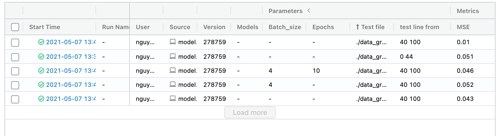

# End-to-End ML Systems Development

The goal of this tutorial is to practice managing end-to-end ML systems development. An end-to-end ML systems development includes many steps, **not just running and managing experiments for the ML models**.

## Study goal

Not only developing a machine model is not an easy task, but building a machine learning system is very challenging and it is much more than dealing with machine learning model. The goal of this tutorial is to learn how to manage a machine learning project in an end-to-end manner. Such a project is also very complicated and envolving. How can you move from having a dataset to a functioning prediction models deployed?

<!-- For instance, choosing the best value for a paremeter alpha is not obvious. How do you keep record of the model peformance with different parameters and compare them to get the best result?

After choosing the best parameter, you might want to share your model to either your teammates or other stakeholder who need to examine your models etc. This process might take a lot of time an effort, and does not guarantee that they would be able to reproduce your best result. This means the model should be packaged in a reusable, and reproducable form.

The ultimate goal of most machine learning model is to be served to end users ideally in a variety of downstream tools - for example real time through REST API or batch inference on Apache Spark. This can be a very time consuming process if you do not have the right tool to deploy your model.

Last but not least, after all mentioned concerns, it would be a big bonus point in your machine learning project management if you can govern the full life cycle of an model, including diferent versions, stage transitions, and annotations. -->

## Requirements, Data for Model development, and Managing Metadata about data

### Import questions
You start building an ML model based on data. Key steps in preparing data

* identify the data you have for model development
* capture requirements for your ML model/service
* create suitable metadata for the data to be used
* checking quality of data, improving data and updating metadata

### Practice
We will carry out a case study of ML development for predictive maintenance in BTS.

We use the BTS (Base Transceiver Stations), the raw data can be accessed from: `tutorials/MLProjectManagement/BTS_Example/raw_data`

### Data Understanding and characterization and development requirements

#### Important questions

* Do you understand the data?
* Is the current form of data good for us to start? What does it mean good?
* Which fields of data are important that can be used for ML?
* Who actually could help you to understand the data and its business?
* If you make some decisions, can you document and use the document to explain your decision to relevant stakeholder later on?

#### Practice
For example, read [our initial work on requirements for explainability in an end-to-end ML development](https://research.aalto.fi/en/publications/holistic-explainability-requirements-for-end-to-end-machine-learn) and work on some selected questions.

### Data Transformation, Enrichment and Featuring

### Important questions:
- do we need to transform the data?
- should we enrich the data?
- which features should we select for ML models and why?

### Practice

The BTS data that we have is still in its raw format and are not ready to be used for the prediction model. Thus, we need to preprocess the data. We would first convert the `reading_time`, then group the data by `station_id` and `parameter_id`. This process can be done by executing the code below, or the file `group_data.py`.

```python
import pandas as pd
import os, fnmatch

bts_df = pd.DataFrame()
listOfFiles = os.listdir('./raw_data')
pattern = "*.csv"

for files in listOfFiles:
    if fnmatch.fnmatch(files, pattern):
        cur_df = pd.read_csv("./raw_data/{}".format(files))
        bts_df = bts_df.append(cur_df)

bts_df["unix_timestamp"] = pd.to_datetime(bts_df["reading_time"]).astype(int)
mean_time = bts_df["unix_timestamp"].mean()
min_time = bts_df["unix_timestamp"].min()
bts_df["norm_time"] = (bts_df["unix_timestamp"]-mean_time)/(3600*1000000000)
bts_df = bts_df.sort_values(by=['norm_time'])
bts_df.drop(["reading_time"], axis='columns', inplace=True)

bts_df_grouped = bts_df.groupby(["station_id","parameter_id"])
for key,item in bts_df_grouped:
    sub_data = bts_df_grouped.get_group(key)
    mean_val = sub_data['value'].mean()
    sub_data['norm_value'] = sub_data['value']-mean_val
    max_val = sub_data['norm_value'].max()
    sub_data['norm_value'] = sub_data['norm_value']/max_val
    sub_data.sort_values(by=['norm_time']).to_csv("./data_grouped/{}_{}_.csv".format(key[0],key[1]), index=False)
    print("Finish: {}".format(key))
```
After grouping the data, we need to do some further pre-processing to turn our data into serial data, and normalize the data. You can use the following code, or open the file `Model.ipynb` and test the code directly.
```python
import matplotlib.pyplot as plt
import numpy as np
import pandas as pd
import tensorflow as tf

from tensorflow import keras
from tensorflow.keras import layers
from tensorflow.keras.layers.experimental import preprocessing
import mlflow
raw_dataset = pd.read_csv("./data_grouped/1161114002_122.csv")
raw_dataset = raw_dataset.astype({'id':'float','value':'float', 'station_id':'int', 'parameter_id':'int', 'unix_timestamp':'int', 'norm_time':'float'})
dataset = raw_dataset.copy()
dataset = dataset.dropna().drop(['id','station_id','parameter_id','unix_timestamp'], axis=1)
dataset_full = dataset.sort_values(by=['norm_time'])
dataset = dataset_full[0:300]

serial_data = dataset.drop(['value','norm_time'], axis=1)
serial_data['norm_1'] = serial_data['norm_value'].shift(1)
serial_data['norm_2'] = serial_data['norm_value'].shift(2)
serial_data['norm_3'] = serial_data['norm_value'].shift(3)
serial_data['norm_4'] = serial_data['norm_value'].shift(4)
serial_data['norm_5'] = serial_data['norm_value'].shift(5)
serial_data['norm_6'] = serial_data['norm_value'].shift(6)
serial_data = serial_data[6:]
```
You could do the same to process the test dataset.

## Developing ML models

### ML Algorithms

#### Important questions
- Which ML algorithms should we choose in order to create suitable ML models? why?

#### Practice

We assume that you follow existing methods to select ML algorithms to create suitable models. In this practice, we will use LSTM.
>Note: link to LSTM

### Training and ML model experiments

#### Important questions
After having the model selection and suitable methods:
- How will you do the training and model experiments?
- How will we record performance metrics, machine information, etc. and associate them with the data to be used (and the metadata) so that we can have all information is linked for an end-to-end ML experiment.
- How would we manage thousands of experiments?
- How to evaluate or compare your experiments based on multiple metrics? What would be an appropriate solution?

#### Tools for experimenting ML models

There are many tools. [MLflow](https://mlflow.org/) might be a good tool to help you stay on top of what is going on. Using MLFlow,  we study how to capture the relationships among configurable parameters, machine learning code, the input data, output result, and performance metrics.
____
> MLflow introduction and installation: MLFlow is a popular python package for machine learning life cycle. It provides many functions such as follows:
> - Tracking: track experiments to store parameters and results.
>- Packaging: package the project code in reproducible form in order to share or transfer to production.
>- Deploying: manage and deploy models from a variety of machine learning libraries.
_____

MLflow allows us to collect experimental data for your machine learning applications. These data are usually useful for further analysis, statistics, prediction and optimization.
>Other tools for storing experiments are:
> - https://www.verta.ai/

To get you ready for the tutorial, please don't forget to install MLflow and scikit-learn first. It is recommended that you install Anaconda for simplifying package management and deployment. You can download the corresponding version of anaconda [here](https://www.anaconda.com/distribution)

Use the package manager [pip](https://pip.pypa.io/en/stable/) to install mlflow.

```bash
    $pip install mlflow
```

For executing some examples of this tutorials, you need to install scikit-learn

```bash
    $pip install scikit-learn
```
>At this point, we recommend you to take a walk through the official tutorial of MLflow for an overview of how MLflow works with some simple examples: <https://www.mlflow.org/docs/latest/tutorials-and-examples/tutorial.html>.

#### Running experiments for ML models

You would need to have a machine learning model to test out MLflow, you can use any model that you have already developed, or develop one if you feel like.
The model is described at the beginning of this tutorial.

We use a BTS model whose code can be found in the file `model.py` or [here](https://github.com/rdsea/IoTCloudSamples/tree/master/MLUnits/BTSPrediction)

```python


train_dataset = serial_data
test_dataset = test_serial_data
train_features = np.array(train_dataset.drop(['norm_value'], axis=1))
train_features = np.array(train_features)[:,:,np.newaxis]
train_labels = np.array(train_dataset.drop(['norm_6'], axis=1))
train_labels = train_labels.reshape(train_labels.shape[0],train_labels.shape[1],1)
test_features = np.array(test_dataset.drop(['norm_value'], axis=1))
test_features = test_features.reshape(test_features.shape[0],test_features.shape[1],1)
test_labels = np.array(test_dataset.drop(['norm_6'], axis=1))
test_labels = test_labels.reshape(test_labels.shape[0],test_labels.shape[1],1)

with mlflow.start_run():
    model = keras.Sequential()
    model.add(layers.LSTM(32, return_sequences=True))
    model.add(layers.LSTM(32, return_sequences=True))
    model.add(layers.TimeDistributed(layers.Dense(1)))
    model.compile(loss='mean_squared_error', optimizer=tf.keras.optimizers.Adam(0.005))
    model.fit(train_features, train_labels, epochs=200, batch_size=4, verbose=2)

    result = model.predict(test_features, batch_size=1, verbose=0)
    x=pd.DataFrame(test_labels.reshape(test_labels.shape[0],test_labels.shape[1]))
    y=pd.DataFrame(result.reshape(result.shape[0],result.shape[1]))
    y_true = np.array(x[0])
    y_pred = np.array(y[0])

    mse = mean_squared_error(y_true, y_pred)
    print("MSE", mse)
    # Log metric, and params to MLflow
    mlflow.log_metric("MSE",mse)
    mlflow.log_param("test line from ", '{} {}'.format(start_line, end_line))
    mlflow.log_param("Test file", test_file_name)
    plt.plot(x.index, x[0], label='Data')
    plt.plot(y.index, y[0], color='k', label='Predictions')
    plt.xlabel('index')
    plt.ylabel('norm_value')
    plt.legend()
    plt.savefig("BTS_resultGraph.png")
    mlflow.log_artifact("BTS_resultGraph.png")
    plt.show()
    plt.close()
```

#### Running model experiments

* TODO:

```bash
    $python
```
You could write a simple script to run the above example many times.
```bash
    $./script_of_experiments.sh
```
You could also modify different parameters, such as the loss function, batch_size, epochs, or the test data file etc, and record them using `mlflow.log_param`, or record the figure using:
```
plt.savefig("BTS_resultGraph.png")
mlflow.log_artifact("BTS_resultGraph.png")```

* After running the examples repeatedly, you might be interested in comparing the performance of ran experiments. Open a terminal in the current working directory and call MLflow user interface using the below command:
```bash
    $mlflow ui
```



* The results are illustrated in the Figure 1 where you can see all the logging parameters and metrics as well as different runs of your experiment. You can also see that the parameters and metrics are separate in the top row since they are logged with different MLflow api (log_param and log_metric.).

#### Examine data and model experiments

Now you have the metadata about data used, models and model experiments, you can check and link all the data together.
>Here will be example of all metrics, metadata, etc. associated with the model in an end-to-end view to explain the relationship between data, model and metrics obtained from model experiment, all together are part of ML experiments.

## Model Serving /ML Service

### Important questions
- How to pack and move code to serving platforms
- Which service platforms should we use?
- How to deploy and manage ML services?
### Packing the model code
Given the model experimented, we can package and perform the model serving.
> You can check [our serving tutorial](../MLServing).

In the following explain basic steps to package models and record them.


>Note: this example is based on the model mentioned in the previous section

Now, after discovering the best combination of alpha and l1_ratio, you want to share your ml code with other data scientist in a reusable, and reproducible form. You can packing the code in a virtual environment such as conda so that the code can be executed everywhere.
In order to package the code using MLflow, you have to create MLProject and description files which define the requirements for executing the code. The below files are an example for packaging the code at <https://github.com/mlflow/mlflow-example> and execute it in the conda environment.

Create MLProject file

```yaml
  TODO
 ```
Create conda.yaml to define all requirements for the python program

 ```yaml
TODO
 ```

After defining the MLProject and conda.yaml files. You can run your code in another conda environment using the following command:

 ```bash
    $ mlflow run
 ```

Notably, the directory ml_experiments is where your MLProject and conda.yaml are located. It can have any name that you have created for your project. Figure 2 is an illustration of the result after the program completed. As you can see in the picture, mlflow has created a conda environment for your project with the id 'mlflow-f175708099db6c37e65aca9c773737a0ff03ecbc' and executed your code in that environment. With this approach, your code can be executed everywhere that has mlflow.

>TODO figure

### Link Packaged models with ML experiments

>TODO: how do we link the package models with models, data, etc. that we have before. After this step, we can query all related information, including packaged models.


###  Serving Models
Given the packaged models, you can select suitable one and deploy as a service.

In the following we show to do this using MLflow:

MLflow Model has a standard format for packaging machine learning models that can be used in a variety of downstream tools.
For example, the model can be used to serve as a service through a REST API.

Student can go to the UI to check the saving model:
 ```bash
    $mlflow ui
 ```
<!-- FIX ME: CHANGE THIS TO SOMETHING ELSE -->
Deploy the server using the saving model:

 ```bash
   $mlflow models serve -m
 ```
After the server is deployed successfully, you will see a result similar to the Figure 3 where your training model is deployed and ready to serve the prediction.

>TODO: figure

But maybe it is a good practice to test if the deployed model is actually working correctly? You can do prediction for your testing data using the deployed model such as follows:

 ```bash

   $curl -X POST -H  http://127.0.0.1:1234/invocations
 ```

## Monitoring ML services and Linking the service monitoring data to ML Experiments

### Questions
- Now the model is deployed and running as a service. You can use monitoring techniques to monitor the service. Assume that you want to monitor more complex metrics such as cost, peformance of your API functions, what are the suitable solutions?
- Then how can you link the monitoring data of the service back to the model, model experiments, trained data, etc.

### Further tutorials

We will do ML service monitoring using other tutorials
- [Performance Monitoring](../PerformanceMonitoring/)
- [Quality of Analytics for ML](../qoa4ml)


## References and additional links

Interesting resources about ML engineering:
* [Best Practices for ML Engineering by Martin Zinkevic](https://developers.google.com/machine-learning/guides/rules-of-ml)

Part of the tutorial is built upon MLflow official documents. The main references are:
* https://www.mlflow.org/docs/latest/index.html
* https://www.mlflow.org/docs/latest/models.html#models
* https://mlflow.org/docs/latest/tutorials-and-examples/index.html
* https://github.com/mlflow/mlflow/tree/master/examples/sklearn_elasticnet_wine

Some old slides and video for running MLflow with the Wine prediction
* [Slides](ML_ProjectManagement_2020.pdf)
* [A hands-on video](https://aalto.cloud.panopto.eu/Panopto/Pages/Viewer.aspx?id=82c1f408-048a-416e-ac73-ac3e00d9d31a)
