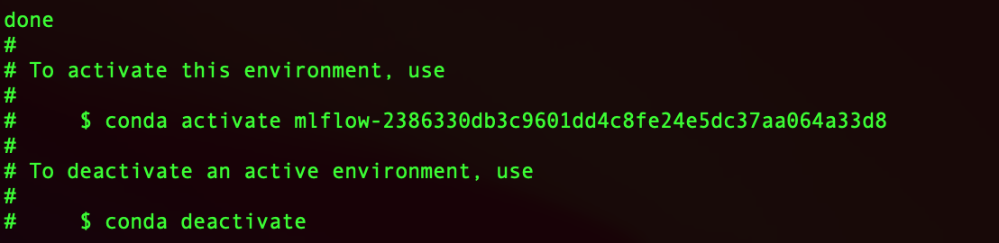
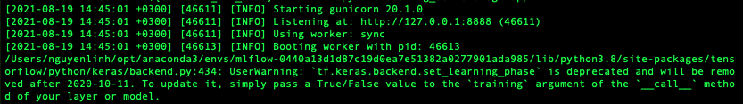

# End-to-End ML Systems Development

The goal of this tutorial is to discuss and practice managing the **end-to-end ML system development**. An end-to-end ML system development  includes many phases, such as data collection, data pre-processing, ML model serving, **not just running experiments for (training of) the ML models**.

## Motivation and study goal

Managing a machine learning project is a very complicated process involving a huge manual effort. How can you effectively manage the end-to-end process from having a dataset to serving prediction models?
> We suggest you to follow all steps, especially studying and practicing key questions posted. However, you can use different datasets and different models to practice the tutorial. If you want to train a model using federated ML frameworks for advanced topics, you can check our [Introduction to FL](../../slides/cs-e4660-introduction-FL-v0.3.pdf) and use suitable tools mentioned in the slides, such as [Flower](https://flower.ai/). For experiment data, you can check [the experiment of Fraud Detection in the experiment in our UCC paper](https://acris.aalto.fi/ws/portalfiles/portal/105781165/Enabling_Awareness_of_Quality_of_Training_and_Costs_in_Federated_Machine_Learning_Marketplaces.pdf).
## Requirements, data for model development, and metadata about data

### Important questions
You start building an ML model based on existing data and requirements. Key steps in preparing data

* Investigate the data - how/which ML model can be applied?
* What is the requirements for your ML model/service?
* Why do we need to manage metadata? which metadata of data/model must be managed?
* Dealing with dynamic changes in data quality, how can we improve model serving?

### Practice

We will carry out a case study of ML development for predictive maintenance in BTS (Base Transceiver Stations). The example raw data can be accessed from: `tutorials/MLProjectManagement/BTS_Example/raw_data`

>currently the raw data is not uploaded because we are still figuring out a way to not have to upload the whole day of data, contact us if you need raw data at the moment

### Prerequisite
* [Anaconda](https://www.anaconda.com/) or [Python3 Virtualenv](https://docs.python.org/3/library/venv.html)
* [Pandas](https://pandas.pydata.org/), [numpy](https://numpy.org/)
* [TensorFlow](https://www.tensorflow.org/install)
* [MLflow](https://www.mlflow.org/docs/latest/quickstart.html)
### Data understanding and characterization and development requirements

#### Important questions

* Do you understand the data?
* Is the current form of data good for us to start? What does it mean good?
* Which fields of data are important that can be used for ML?
* Who actually could help you to understand the data and its business?
* If you make some decisions, can you document and use the document to explain your decision to relevant stakeholder later on?

#### Practice
- Check BTS data and discuss data fields

- Requirements: for example, read [our initial work on requirements for explainability in an end-to-end ML development](https://research.aalto.fi/en/publications/holistic-explainability-requirements-for-end-to-end-machine-learn) and work on some selected questions.

### Data transformation, enrichment and featuring

#### Important questions:
- Do we need to transform the data?
- Should we enrich the data with additional data? where is the additional data?
- Which features should we select for ML models and why?

#### Practice

The BTS data that we have is still in its raw format and are not ready to be used for the prediction model. Thus, we need to preprocess the data. We would first convert the `reading_time`, then group the data by `station_id` and `parameter_id`. This process can be done by executing the code below, or the **file `group_data.py`**.

```python
import pandas as pd 
import os, fnmatch

# Init empty DataFrame for loading data
bts_df = pd.DataFrame()

# Read list of files in raw_data folder
listOfFiles = os.listdir('./raw_data')
# Take only .csv file
pattern = "*.csv"

# Load raw data to DataFrame
for files in listOfFiles:
    if fnmatch.fnmatch(files, pattern):
        cur_df = pd.read_csv("./raw_data/{}".format(files))
        bts_df = bts_df.append(cur_df)

# Convert time from unix timestamp to integer
bts_df["unix_timestamp"] = pd.to_datetime(bts_df["reading_time"]).astype(int)

# Normalize timestamp data
mean_time = bts_df["unix_timestamp"].mean()
min_time = bts_df["unix_timestamp"].min()
bts_df["norm_time"] = (bts_df["unix_timestamp"]-mean_time)/(3600*1000000000)

# Sort data and remove unnecessary features 
bts_df = bts_df.sort_values(by=['norm_time'])
bts_df.drop(["reading_time"], axis='columns', inplace=True)

# Group data by station ID and parameter ID
# -> making prediction on individual parameters for each station
bts_df_grouped = bts_df.groupby(["station_id","parameter_id"])

# Processing grouped data
for key,item in bts_df_grouped:
    sub_data = bts_df_grouped.get_group(key)
    # Normalize value in each group
    mean_val = sub_data['value'].mean()
    sub_data['norm_value'] = sub_data['value']-mean_val
    max_val = sub_data['norm_value'].max()
    sub_data['norm_value'] = sub_data['norm_value']/max_val
    sub_data.sort_values(by=['norm_time']).to_csv("./data_grouped/{}_{}_.csv".format(key[0],key[1]), index=False)
    print("Finish: {}".format(key))
```

After grouping the data, we need to do some further pre-processing to turn our data into serial data, and normalize the data. You can use the following code, or **open the file `Model.ipynb`** and test the code directly.

* Note: You can simply install Jupyter Notebook: 
```
$ pip install jupyter
# Register kernel with your current python virtual environment
$ python -m ipykernel install --user --name=<your_kernel_name>
```


```python
import matplotlib.pyplot as plt
import numpy as np
import pandas as pd
import tensorflow as tf

from tensorflow import keras
from tensorflow.keras import layers
from tensorflow.keras.layers.experimental import preprocessing
import mlflow
# Load grouped dataset
# We will train the ML model with dataset from station "1161114004" on the parameter "122"
grouped_dataset = pd.read_csv("./data_grouped/1161114004_122_.csv")

# Take data features with specific data type
grouped_dataset = grouped_dataset.astype({'id':'float','value':'float', 'station_id':'int', 'parameter_id':'int', 'unix_timestamp':'int', 'norm_time':'float'})

dataset = grouped_dataset.copy()

# Drop error/None data and unused features
dataset = dataset.dropna().drop(['id','station_id','parameter_id','unix_timestamp'], axis=1)
dataset_full = dataset.sort_values(by=['norm_time'])


# Shift the data to creat a short time series (6 data points) for each record
serial_data = dataset.drop(['value','norm_time'], axis=1)
serial_data['norm_1'] = serial_data['norm_value'].shift(1)
serial_data['norm_2'] = serial_data['norm_value'].shift(2)
serial_data['norm_3'] = serial_data['norm_value'].shift(3)
serial_data['norm_4'] = serial_data['norm_value'].shift(4)
serial_data['norm_5'] = serial_data['norm_value'].shift(5)
serial_data['norm_6'] = serial_data['norm_value'].shift(6)
train_dataset = serial_data[6:]
```
You could do the data extraction from another power grid data file to test the model. We could also assign the starting line and ending line of the data that we use to test the model from the command line. The testing data should be pre-processed in the same way as the training data

```python
# Read test dataset from a different file
# We will test the trained ML model with data from station "1161114002" on the same parameter "122"
test_file_name = "./data_grouped/1161114002_122_.csv"
test_grouped_dataset = pd.read_csv(test_file_name)
test_grouped_dataset = test_grouped_dataset.astype({'id':'float','value':'float', 'station_id':'int', 'parameter_id':'int', 'unix_timestamp':'int', 'norm_time':'float'})
test_dataset = test_grouped_dataset.copy()
test_dataset = test_dataset.dropna().drop(['id','station_id','parameter_id','unix_timestamp'], axis=1)
test_dataset_full = test_dataset.sort_values(by=['norm_time'])
# Choose a small part of the data to test the model
start_line = 0
end_line = 100
test_data = test_dataset_full[start_line:end_line]
test_data = test_dataset_full[start_line:end_line]

# Similar to training dataset -> making a time series input for ML prediction
test_serial_data = test_data.drop(['value','norm_time'], axis=1)
test_serial_data['norm_1'] = test_serial_data['norm_value'].shift(1)
test_serial_data['norm_2'] = test_serial_data['norm_value'].shift(2)
test_serial_data['norm_3'] = test_serial_data['norm_value'].shift(3)
test_serial_data['norm_4'] = test_serial_data['norm_value'].shift(4)
test_serial_data['norm_5'] = test_serial_data['norm_value'].shift(5)
test_serial_data['norm_6'] = test_serial_data['norm_value'].shift(6)
test_dataset = test_serial_data[6:]
```

### Metadata about data

*Concern*: 
> We examine data and we start to use it for ML model development. What if we dont keep track the information about the data? What do you think?

Researchers have discussed the importance of keeping the information about data to be used for ML. Try to read the following papers:
* Timnit Gebru, Jamie Morgenstern, Briana Vecchione, Jennifer Wortman Vaughan, Hanna Wallach, Hal Daumé III, and Kate Crawford. 2021. [Datasheets for datasets](https://dl.acm.org/doi/10.1145/3458723). Commun. ACM 64, 12 (December 2021), 86–92.


#### Works for some important questions

- why do we need to keep metadata about data?
- what are types of metadata? how to obtain them?

#### Practice

Currently, there are existing tools to store metadata of the dataset, e.g BigQuery, Atlas, and to manage and discovery data such as Google Cloud Data Catalog and IBM Knowledge Catalog, etc. However, there is a lack of framework for capturing complex relationships between the datasets and different entities (e.g: other dataset, ML model) in a ML solution.


Metadata of the dataset can be used to manage information of the datasets. Metadata object should include different aspects of the dataset, such as data management aspect (Name, version, url, size, created_time, last_modified_time, provider, description), dataset_dependency, and quality of data (completeness, label_ratio, etc).
Following json is an example of the metadata for dataset used in this example:
```json
[
    {
        "Dataset_id": "bts1",
        "Name": "bts_param",
        "Created_time": "",
        "Last_modified_time": "05/31/2021, 14:07:25",
        "Version": "1.0",
        "URL": "examples/BTS_Data/raw_data",
        "Provider": "BachPhu",
        "Description": "",
        "Size": {
            "value": "194,5",
            "unit": "MB"
        },
        "Data_type": [
            "Time Series"
        ],
        "Dataset_dependency": {
            "bts02": {
                "Type_of_relationship": "output"
            }
        },
        "Quality_of_data": {
            "completeness": {
                "Value": "0.9"
            },
            "label_ratio": {
                "Value": "0.9"
            }
        }
    }
]
```

In this tutorial:
> You shall set the goal to find a suitable way that you want to keep metadata that can be updated and retrieved easily based on our ML development tools.  

## Developing ML models

### ML Algorithms

#### Important questions

- Which ML algorithms should we choose in order to create suitable ML models? why?
- For explainability of your choice (to other stakeholders), how would you document the explanation of the choice?

#### Practice

Next steps are model training and model experiments. We will need to record performance metrics, machine information, etc. and associate them with the data to be used (and the metadata) so that we can have all information is linked for an end-to-end ML experiment.
We assume that you follow existing methods to select ML algorithms to create suitable models. In this practice, we will use [LSTM](https://en.wikipedia.org/wiki/Long_short-term_memory).


### Training and ML model experiments

#### Important questions
After having the model selection and suitable methods:
- How will you do the training and model experiments?
- How will we record performance metrics, machine information, etc. and associate them with the data to be used (and the metadata) so that we can have all information is linked for an end-to-end ML experiment.
- How would we manage thousands of experiments?
- How to evaluate or compare your experiments based on multiple metrics? What would be an appropriate solution?

#### Tools for experimenting ML models

There are many tools. [MLflow](https://mlflow.org/) might be a good tool to help you stay on top of what is going on. Using MLFlow,  we study how to capture the relationships among configurable parameters, machine learning code, the input data, output result, and performance metrics.
____
> MLflow introduction and installation: MLFlow is a popular python package for machine learning life cycle. It provides many functions such as follows:
>- Tracking: track experiments to store parameters and results.
>- Packaging: package the project code in reproducible form in order to share or transfer to production.
>- Deploying: manage and deploy models from a variety of machine learning libraries.
_____

MLflow allows us to collect experimental data for your machine learning applications. These data are usually useful for further analysis, statistics, prediction and optimization.
>Other tools for storing experiments are:
> - https://www.verta.ai/
> - https://www.comet.com/site/
> - https://neptune.ai/
> - https://wandb.ai/site

To get you ready for the tutorial, please don't forget to install MLflow and scikit-learn first. It is recommended that you install Anaconda for simplifying package management and deployment. You can download the corresponding version of anaconda [here](https://www.anaconda.com/distribution)

Use the package manager [pip](https://pip.pypa.io/en/stable/) to install mlflow.

```bash
$pip install mlflow
```

For executing some examples of this tutorials, you need to install scikit-learn

```bash
$pip install scikit-learn
```

#### Running experiments for ML models

You would need to have a machine learning model to test out MLflow, you can use any model that you have already developed, or develop one if you feel like.

We use a BTS model whose code can be found in the file `model.py` or [here](https://github.com/rdsea/IoTCloudSamples/tree/master/MLUnits/BTSPrediction)

```python
# MLflow start recording training metadata
    with mlflow.start_run():
        # Init ML model
        model = keras.Sequential()
        # check number of parameter 
        n = sys.argv[1] if len(sys.argv) > 1 else 2

        node_param = [] 
        # Load defaut model configuration if not given
        file_name = sys.argv[2] if len(sys.argv) > 2 else "conf.txt"
        with open(file_name, 'r') as f:
            content = f.read()
            node_param = content.split(",")

        # setup model layer based on loaded configuration
        for i in range(int(n)):
            model.add(layers.LSTM(int(node_param[i]), return_sequences=True))
        model.add(layers.TimeDistributed(layers.Dense(1)))
        # Setup model optimizer
        model.compile(loss='mean_squared_error', optimizer=tf.keras.optimizers.Adam(0.005))
        # Train ML model
        fitted_model = model.fit(train_features, train_labels, epochs=2, batch_size=1, verbose=2, validation_data=(test_features, test_labels))
        # Create model signature
        signature = infer_signature(test_features, model.predict(test_features))
        # Let's check out how it looks
        # MLflow log model training parameter
        mlflow.log_param("number of layer", n)
        mlflow.log_param("number of node each layer", node_param)
        fit_history = fitted_model.history
        # MLflow log training metric
        for key in fit_history:
            mlflow.log_metric(key, fit_history[key][-1])
        
        model_dir_path = "./saved_model"
        
        # Create an input example to store in the MLflow model registry
        input_example = np.expand_dims(train_features[0], axis=0)
        
        # Let's log the model in the MLflow model registry
        model_name = 'LSTM_model'
        mlflow.keras.log_model(model,model_name, signature=signature, input_example=input_example)
```
We can log the input example for the model using `mlflow.keras.log_model` with `input_example`.

#### Running model experiments


```bash
$python model.py
```
You could also modify different parameters, such as the loss function, batch_size, epochs, or the test data file etc, and record them using `mlflow.log_param`.

* Note: You can practice training ML models with different configurations to create different model versions. Then, identify which metrics need to be managed by MLflow and how to compare performance between different versions.


Open a terminal in the current working directory and call MLflow user interface using the below command:
```bash
$mlflow ui
```


* The results are illustrated in the Figure 1 where you can see all the logging parameters and metrics as well as different runs of your experiment. You can also see that the parameters and metrics are separate in the top row since they are logged with different MLflow api (log_param and log_metric.). In this example, we train the model with different set of layers and nodes for each layer, which is passed through the command line, and log by log_param, and the metric collected is the loss of the last epoch.

#### Examine data and model experiments

Now you have the metadata about data used, models and model experiments, you can check and link all the data together. For example:
```json
{
    "Model_id": "md1",
    "Name": "BTS_LSTM",
    "Status": [
        "ready to use"
    ],
    "Version": "1.0",
    "Description": "",
    "Time_created": "",
    "Artefact": {
        "Url": "",
        "Format": "raw code",
        "License": "000"
    },
    "Quality_of_model": {
        "Accuracy": {
            "operators": [
                "min",
                "max"
            ],
            "unit": "percentage",
            "value": "value",
            "class": [
                "Accuracy"
            ]
        },
        "MSE": {
            "operators": [
                "min",
                "max"
            ],
            "unit": "percentage",
            "value": "value",
            "class": [
                "Accuracy"
            ]
        }
    },
    "Dataset_dependecy": {
        "bts02": {
            "type_of_relationship": "input"
        }
    },
    "Model_dependency": {},
    "Package_dependency": {
        "numpy": {
            "version": "1.19.5",
            "source": ""
        },
        "pandas": {
            "version": "1.2.4"
        }
    }
}
```
This metadata of the model capture the model in an end-to-end view to explain the relationship between data, model and metrics obtained from model experiment, all together are part of ML experiments.

## Model serving/ML service

### Important questions

- How to pack and move code to serving platforms
- Which service platforms should we use?
- How to deploy and manage ML services?

### Packing the model code
Given the model experimented, we can package and perform the model serving.
> You can check [our serving tutorial](../MLServing).

In the following explain basic steps to package models and record them.

>Note: this example is based on the model mentioned in the previous section

Now, you want to share your ml code with other data scientist in a reusable, and reproducible form. You can packing the code in a virtual environment such as conda so that the code can be executed everywhere.
In order to package the code using MLflow, you have to create MLproject and description files which define the requirements for executing the code. The below files are an example for packaging the code at <https://github.com/mlflow/mlflow-example> and execute it in the conda environment.

Create MLproject file
```
name: tutorial

conda_env: conda.yaml

entry_points:
  main:
    parameters:
      configuration_file: {type: string, default: "conf.txt"}
    command: "python model.py --conf {configuration_file}"
```
Create conda.yaml to define all requirements for the python program
```yaml
name: tutorial
channels:
  - defaults
dependencies:
  - python=3.8.11
  - numpy==1.18.5
  - pandas>=1.0.0
  - scikit-learn
  - matplotlib
  - pip
  - pip:
    - mlflow
    - cffi==1.14.6
    - pandas==1.2.4
    - pillow==8.3.1
    - pyyaml==5.4.1
    - scipy==1.6.2
    - tensorflow==2.4.1
```

After defining the MLproject and conda.yaml files. You can run your code in another conda environment using the following command from the parent directory:

```bash
$ mlflow run BTS_Example
```
or run it with custom parameters:
```bash
$ mlflow run BTS_Example/ -P configuration_file="conf.txt"
```
Notably, the directory ml_experiments is where your MLproject and conda.yaml are located. Figure 2 is an illustration of the result after the program completed. As you can see in the picture, mlflow has created a conda environment for your project with a run id and executed your code in that environment. With this approach, your code can be executed everywhere that has mlflow.



###  Serving Models
Given the packaged models, you can select suitable one and deploy as a service.

In the following we show to do this using MLflow:

MLflow Model has a standard format for packaging machine learning models that can be used in a variety of downstream tools.
For example, the model can be used to serve as a service through a REST API.

Student can go to the UI to check the saving model:
```bash
$ mlflow ui
```
or with the mlflow server:
```bash
$ mlflow server -h 0.0.0.0
```
Deploy the server using the saved model:
```bash
$mlflow models serve -m mlruns/0/project_id/artifacts/LSTM_model -p 8888
```
After the server is deployed successfully, you will see a result similar to the Figure 3 where your training model is deployed and ready to serve the prediction.




To test if the deployment works correctly, you can do prediction for your testing data using the deployed model such as follows:
Testing data:
```JSON
{
  "inputs": [
    [
      [ 0.074], [-0.003], [-0.08] ,[ -0.157], [-0.235], [-0.312]]
    ]

}
```
End point:
```bash

http://127.0.0.1:8888/invocations

```
You can also use the following simple client code in **[client.py]** to send request to the api endpoint.
```python
# importing the requests library
import requests
# defining the api-endpoint
API_ENDPOINT = "http://0.0.0.0:8888/invocations"

# data to be sent to api
param = {
  "inputs": [[[ 0.074], [-0.003], [-0.08] ,[ -0.157], [-0.235], [-0.312]]]
}

# sending post request and saving response as a json object
response = requests.post(url = API_ENDPOINT, json = param)
result = response.json()
# extracting result
print(result[0][0])
```

## Further important aspects and tutorials

### Questions
- Now the model is deployed and running as a service. You can use monitoring techniques to monitor the service. Assume that you want to monitor more complex metrics such as cost, performance of your API functions, what are the suitable solutions?
- Then how can you link the monitoring data of the service back to the model, model experiments, trained data, etc.

### Further tutorials

We will do ML service monitoring using other tutorials
- [Performance Monitoring](../PerformanceMonitoring/)
- [Quality of Analytics for ML](../qoa4ml)


## References and additional links

Rsources about ML engineering:
* [Best Practices for ML Engineering by Martin Zinkevic](https://developers.google.com/machine-learning/guides/rules-of-ml)
* ["Operationalizing Machine Learning: An Interview Study"](https://arxiv.org/pdf/2209.09125v1.pdf)
* [Machine Learning eXchange (MLX)](https://github.com/machine-learning-exchange/mlx)

Part of the tutorial related to MLflow (experiments, package, serving) is built upon MLflow official documents. The main references are:
* https://www.mlflow.org/docs/latest/index.html
* https://www.mlflow.org/docs/latest/models.html#models
* https://mlflow.org/docs/latest/tutorials-and-examples/index.html

A old video for running MLflow with the Wine prediction
* [A hands-on video](https://aalto.cloud.panopto.eu/Panopto/Pages/Viewer.aspx?id=82c1f408-048a-416e-ac73-ac3e00d9d31a)
