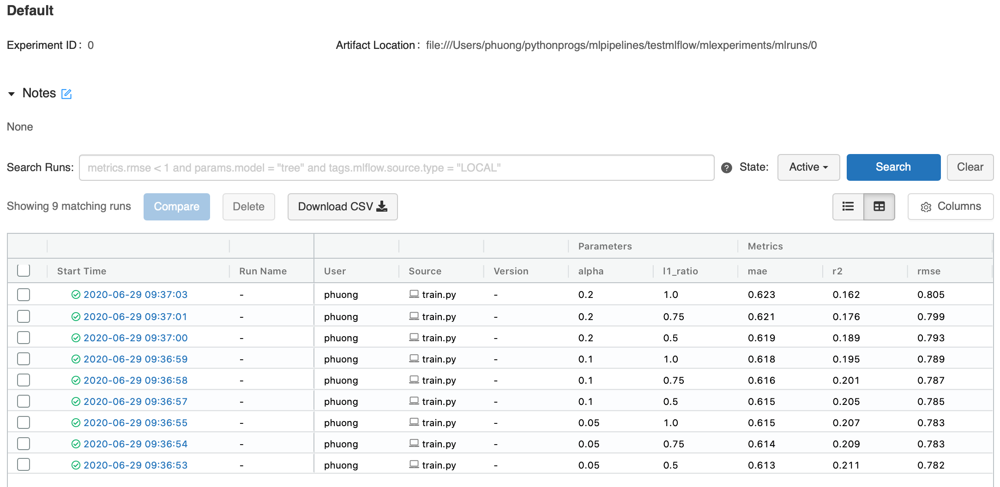
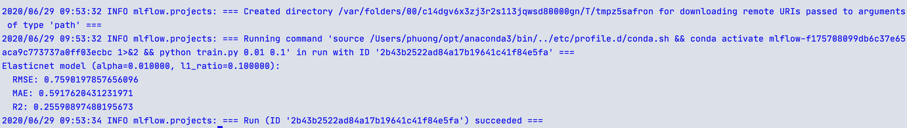
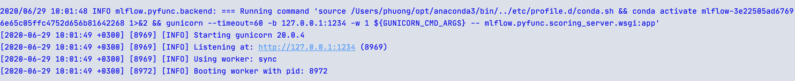

# ML Experiment Management
## Motivation and study goal

Not only developing a machine model is not an easy task, but managing a machine learning project is also very complicated and envolving. For instance, choosing the best value for a paremeter alpha is not obvious. How do you keep record of the model peformance with different parameters and compare them to get the best result? 

After choosing the best parameter, you might want to share your model to either your teammates or other stakeholder who need to examine your models etc. This process might take a lot of time an effort, and does not guarantee that they would be able to reproduce your best result. This means the model should be packaged in a reusable, and reproducable form.

The ultimate goal of most machine learning model is to be served to end users ideally in a variety of downstream tools - for example real time through REST API or batch inference on Apache Spark. This can be a very time consuming process if you do not have the right tool to deploy your model. 

Last but not least, after all mentioned concerns, it would be a big bonus point in your machine learning project management if you can govern the full life cycle of an model, including diferent versions, stage transitions, and annotations.

If one of these issues have been your challenges on managing the project, MLflow might be a good tool to help you stay on top of what is going on.
In this tutorial, we would introduce the management of machine learning experiments using [MLflow](https://mlflow.org/). Within an experiment we study how to capture the relationships among configurable parameters, machine learning code, the input data, output result, and performance metrics. We aim to give you a big picture of machine learning life cycle in this example. 
## MLFlow introduction

MLFlow is a popular python package for machine learning life cycle. It provides many functions such as follows:

- Tracking: track experiments to store parameters and results.
- Packaging: package the project code in reproducible form in order to share or transfer to production.
- Deploying: manage and deploy models from a variety of machine learning libraries.

In this tutorial you can practice basic functionalities of MLflow such as mentioned above. Further to this, you will study how to use MLflow in measuring metrics of a machine learning application via concrete examples. After completing this tutorial, you can use MLflow to collect experimental data for your machine learning applications. These data are usually useful for further analysis, statistics, prediction and optimization.

## Accompanying Slides and Video
* [Slides](ML_ProjectManagement_2020.pdf)
* [A hands-on video as part of this tutorial](https://aalto.cloud.panopto.eu/Panopto/Pages/Viewer.aspx?id=82c1f408-048a-416e-ac73-ac3e00d9d31a)

## Installation
To get you ready for the tutorial, please don't forget to install MLflow and scikit-learn first. It is recommended that you install Anaconda for simplifying package management and deployment. You can download the corresponding version of anaconda [here](https://www.anaconda.com/distribution)

Use the package manager [pip](https://pip.pypa.io/en/stable/) to install mlflow.

```bash
    $pip install mlflow
```

For executing some examples of this tutorials, you need to install scikit-learn

```bash
    $pip install scikit-learn
```

## Basic Example
At this point, we recommend you to take a walk through the official tutorial of MLflow for an overview of how MLflow works with some simple examples: <https://www.mlflow.org/docs/latest/tutorials-and-examples/tutorial.html>.

### 1. A simple python example

You would need to have a machine learning model to test out MLflow, you can use any model that you have already developed, or develop one if you feel like. However, if you do not have time for that, or just want a supper simple model, that is hard to go wrong, you can use this simple linear regression example. The example is based on [mlflow-example-sklearn-elasticnet-wine](https://github.com/databricks/mlflow-example-sklearn-elasticnet-wine/blob/master/train.py)

```python

import os
from mlflow import log_metric, log_param, log_artifact

if __name__ == "__main__":

        ...
        with mlflow.start_run():
        lr = ElasticNet(alpha=alpha, l1_ratio=l1_ratio, random_state=42)
        lr.fit(train_x, train_y)

        predicted_qualities = lr.predict(test_x)

        (rmse, mae, r2) = eval_metrics(test_y, predicted_qualities)

        print("Elasticnet model (alpha=%f, l1_ratio=%f):" % (alpha, l1_ratio))
        print("  RMSE: %s" % rmse)
        print("  MAE: %s" % mae)
        print("  R2: %s" % r2)

        mlflow.log_param("alpha", alpha)
        mlflow.log_param("l1_ratio", l1_ratio)
        mlflow.log_metric("rmse", rmse)
        mlflow.log_metric("r2", r2)
        mlflow.log_metric("mae", mae)

        mlflow.sklearn.log_model(lr, "model")

```

* The model takes two parameter alpha and l1_ratio. You can run the model with default parameters, or try experimenting different values with the command: 

```bash
    $python examples/linear_regression_model/train.py <alpha> <l1_ratio>
``` 
You should write a simple script to run the above example many times.
```bash
    $./script_of_experiments.sh
```

* After running the examples repeatedly, you might be interested in comparing the performance of ran experiments. Open a terminal in the current working directory and call MLflow user interface using the below command:
```bash
    $mlflow ui
```



* The results are illustrated in the Figure 1 where you can see all the logging parameters and metrics as well as different runs of your experiment. You can also see that the parameters and metrics are separate in the top row since they are logged with different MLflow api (log_param and log_metric.).


### 2. Packing the code using MLProjects
Now, after discovering the best combination of alpha and l1_ratio, you want to share your ml code with other data scientist in a reusable, and reproducible form. You can packing the code in a virtual environment such as conda so that the code can be executed everywhere. 
In order to package the code using MLflow, you have to create MLProject and description files which define the requirements for executing the code. The below files are an example for packaging the code at <https://github.com/mlflow/mlflow-example> and execute it in the conda environment.

Create MLProject file
```yaml
[//]: # sklearn_elasticnet_wine/MLproject
        name: tutorial
        conda_env: conda.yaml
        entry_points:
          main:
            parameters:
              alpha: float
              l1_ratio: {type: float, default: 0.1}
            command: "python train.py {alpha} {l1_ratio}"
```
Create conda.yaml to define all requirements for the python program
```yaml
[//]: # sklearn_elasticnet_wine/conda.yaml
            name: tutorial
            channels:
              - defaults
            dependencies:
              - numpy=1.14.3
              - pandas=0.22.0
              - scikit-learn=0.19.1
              - pip:
                - mlflow
```

After defining the MLProject and conda.yaml files. You can run your code in another conda environment using the following command:

```bash
    $ mlflow run ml_experiments/ -P alpha=0.01

```

Notably, the directory ml_experiments is where your MLProject and conda.yaml are located. It can have any name that you have created for your project. Figure 2 is an illustration of the result after the program completed. As you can see in the picture, mlflow has created a conda environment for your project with the id 'mlflow-f175708099db6c37e65aca9c773737a0ff03ecbc' and executed your code in that environment. With this approach, your code can be executed everywhere that has mlflow.




### 3. Serving Models
After showing the model to other data scientists, and optimize it even more, it is time to serve your models to the world. MLflow Model has a standard format for packaging machine learning models that can be used in a variety of downstream tools.
For example, the model can be used to serve as a service through a REST API.

Student can go to the UI to check the saving model:
```bash
    $mlflow ui
```
<!-- FIX ME: CHANGE THIS TO SOMETHING ELSE -->
Deploy the server using the saving model:
```bash
   $mlflow models serve -m /home/path/mlruns/0/79936866205949f0843a941829e59f0a/artifacts/model -p 1234
```

After the server is deployed successfully, you will see a result similar to the Figure 3 where your training model is deployed and ready to serve the prediction.



Hurray! your model is now deployed. But maybe it is a good practice to test if the deployed model is actually working correctly? You can do prediction for your testing data using the deployed model such as follows:

```bash

   $curl -X POST -H "Content-Type:application/json; format=pandas-split" --data '{"columns":["alcohol", "chlorides", "citric acid", "density", "fixed acidity", "free sulfur dioxide", "pH", "residual sugar", "sulphates", "total sulfur dioxide", "volatile acidity"],"data":[[12.8, 0.029, 0.48, 0.98, 6.2, 29, 3.33, 1.2, 0.39, 75, 0.66]]}' http://127.0.0.1:1234/invocations

[4.3112116648803545]

```
## Other example
If you are still want to do more practise with MLflow, you can study more about MLflow with [this example](https://github.com/jeanmidevacc/mlflow-energyforecast)

## References
The tutorial is built upon MLflow official documents. The main references are:
* https://www.mlflow.org/docs/latest/index.html
* https://www.mlflow.org/docs/latest/models.html#models
* https://mlflow.org/docs/latest/tutorials-and-examples/index.html
* https://github.com/mlflow/mlflow/tree/master/examples/sklearn_elasticnet_wine


## Open Questions
1. What would you do to improve the tutorial to manage thousands of experiments?

2. Assume that you want to monitor more complex metrics such as cost, peformance of your API functions, what are the suitable solutions?

3. How to evaluate or compare your experiments based on multiple metrics? What would be an appropriate solution?
