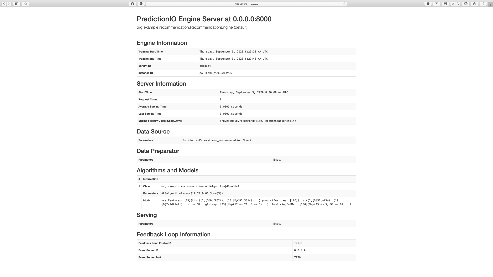
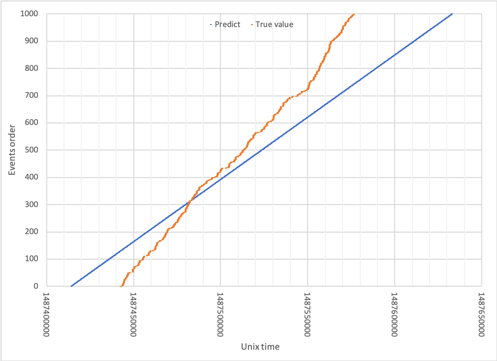
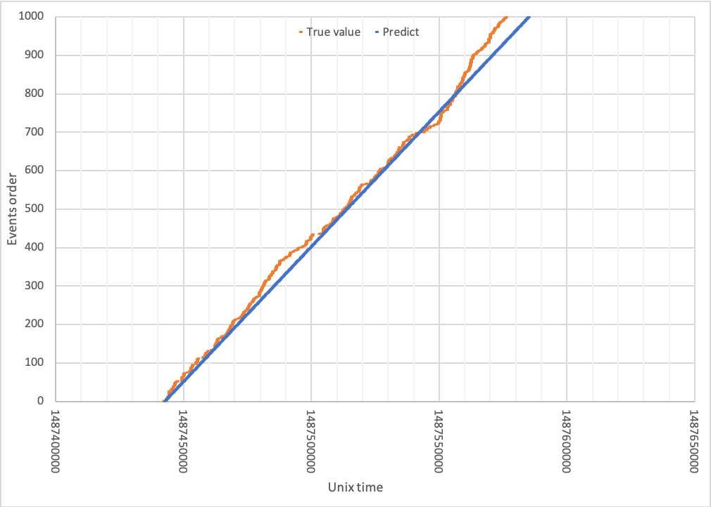
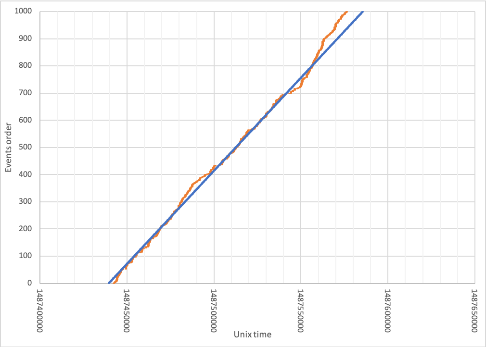

# ML Serving tutorial

## Study goal
The purpose of this tutorial is to create a simple end-to-end pipeline providing Machine Learning (ML) as a service using [PredicitonIO](https://predictionio.apache.org/). This will consists of collecting and preparing data, and developing, training as well as deploying your ML model on PredictionIO server. Given many useful APIs, we can not only import existing data but also send streaming data to server using light weight client application. After deploying model, we can also re-train or replace the model on run time without interrupting ML service.

Apache PredictionIO is an open source ML Server for developers and data scientists to create predictive engines solving many ML tasks. Since other Apache's product such as Hadoop, Spark, HBase focus on develop a single components for the whole ML system, the open source of PredictionIO allows user to deploy the end-to-end ML pipeline with certain level or scalability, elasticity and reliability. 

In this tutorial, we practice ML serving using some basic functionalities of PredictionIO including creating simple ML cluster, colllecting data, developing, providing ML service as well as tuning, retraining or even replacing model at the runtime as it's a part of elasticity while providing ML service. Further, this tutorial gives you some references where you can learn how to completely evaluate your model. 

It is recommended that you use linux environment.

## Accompanying Slides and Video
* [Slides](ml_serving_2020.pdf)
* A hands-on video as part of this tutorial

## Prerequisite

* [Docker Desktop](https://www.docker.com/get-started)
* [Docker PredictionIO](http://predictionio.apache.org/install/install-docker/)
* [PredictionIO library](https://pypi.org/project/PredictionIO/)

## Models under Testing
Withing this tutorial, we introduce 2 ML linear [models](https://version.aalto.fi/gitlab/sys4bigml/cs-e4660/-/tree/tri_tutorial/tutorials/MLServing) which are Linear regression, one uses stochastic gradient descent (SGD) and the other uses BFGS algorithm. Both mentioned models are used to predict the time that the next alarm happen at the specific station based on the previous alarm events. Both models are built based on Apache's template under the [Apache Software Foundation version 2](http://www.apache.org/licenses/LICENSE-2.0) as they must follow the predefined protocol to be deployed in PredicionIO server. [Here](http://predictionio.apache.org/gallery/template-gallery/), you can find more useful templates and instructions. 

Our practices currently are applied on a sample data [BTS dataset](https://version.aalto.fi/gitlab/bigdataplatforms/cs-e4640/-/tree/master/data%2Fbts) introduced in [Big Data Platforms - CS-E4640](https://version.aalto.fi/gitlab/bigdataplatforms/cs-e4640).

Sample data:
| index | old_idx | station_id | datapoint_id | alarm_id | event_time | value | valueThreshold | isActive |
|-------|---------|------------|--------------|----------|------------|-------|----------------|----------|
| 0     | 983     | 1160629000 | 121          | 308      | 1487441883 | 231   | 230            | TRUE     |
| 1     | 984     | 1160629000 | 121          | 308      | 1487442194 | 231   | 230            | TRUE     |
| 2     | 985     | 1160629000 | 121          | 308      | 1487442922 | 231   | 230            | TRUE     |
| 3     | 986     | 1160629000 | 121          | 308      | 1487442929 | 231   | 230            | TRUE     |
| 4     | 987     | 1160629000 | 121          | 308      | 1487442933 | 231   | 230            | TRUE     |

As we're trying to predict the next alarm event for a specific alarm at one station, basically, we only use `index` and `event_time` for our experiments.

Note: Inside the sample test, the `event_time` has been converted to unix timestamp.

At first, we will deploy the first model using SGD to see how well the performance that we got while tuning and update model's parameters at the runtime. Then we train the second model which slightly improves accuracy and may be more efficient for low-end resources.

## Setup PredictionIO cluster
We first start a cluster including a predictionIO server, a spark master, a spark worker and an elasticsearch service.

```bash
    $ docker-compose -f docker-compose.yml \
      -f docker-compose.spark.yml \
      -f elasticsearch/docker-compose.base.yml \
      -f elasticsearch/docker-compose.meta.yml \
      -f elasticsearch/docker-compose.event.yml \
      -f localfs/docker-compose.model.yml \
      up
```

After pulling the images, the script will start Elasticsearch, Apache PredictionIO, and Apache Spark. The event server should be ready at port 7070, and you should see these logs in the command line interface.
```
    ...
    pio_1       | [INFO] [Management$] Your system is all ready to go.
    pio_1       | [INFO] [Management$] Creating Event Server at 0.0.0.0:7070
    pio_1       | [INFO] [HttpListener] Bound to /0.0.0.0:7070
    pio_1       | [INFO] [EventServerActor] Bound received. EventServer is ready.
```

Now we can check the server status using `pio-docker`
```bash
    $ pio-docker status
```
Returned result
```
    [INFO] [Management$] Inspecting PredictionIO...
    [INFO] [Management$] PredictionIO 0.13.0 is installed at /usr/share/predictionio 
    [INFO] [Management$] Inspecting Apache Spark...
    [INFO] [Management$] Apache Spark is installed at /usr/share/spark-2.2.3-bin-hadoop2.7
    [INFO] [Management$] Apache Spark 2.2.3 detected (meets minimum requirement of 1.6.3)
    [INFO] [Management$] Inspecting storage backend connections...
    [INFO] [Storage$] Verifying Meta Data Backend (Source: ELASTICSEARCH)...
    [INFO] [Storage$] Verifying Model Data Backend (Source: LOCALFS)...
    [INFO] [Storage$] Verifying Event Data Backend (Source: ELASTICSEARCH)...
    [INFO] [Storage$] Test writing to Event Store (App Id 0)...
    [INFO] [Management$] Your system is all ready to go.
```

Make sure your cluster is up:
```bash
    $ docker ps
```
```
    CONTAINER ID        IMAGE                                                 COMMAND                  CREATED             STATUS              PORTS                                                                    NAMES
    e989883b63e9        bde2020/spark-worker:2.2.2-hadoop2.7                  "/bin/bash /worker.sh"   2 weeks ago         Up 40 seconds       0.0.0.0:8081->8081/tcp                                                   spark-worker-1
    ef824e448270        predictionio/pio:latest                               "sh /usr/bin/pio_run"    2 weeks ago         Up 40 seconds       0.0.0.0:7070->7070/tcp, 0.0.0.0:8000->8000/tcp, 0.0.0.0:8080->8080/tcp   docker_pio_1
    e2257ec95006        bde2020/spark-master:2.2.2-hadoop2.7                  "/bin/bash /master.sh"   2 weeks ago         Up 41 seconds       6066/tcp, 0.0.0.0:7077->7077/tcp, 0.0.0.0:8090->8080/tcp                 spark-master
    f6d312588d29        docker.elastic.co/elasticsearch/elasticsearch:5.6.4   "/bin/bash bin/es-do…"   3 months ago        Up 41 seconds       9200/tcp, 9300/tcp                                                       docker_elasticsearch_1
```

You may want to run other options which are described at: <https://github.com/apache/predictionio/blob/develop/docker/README.md#run-predictionio-with-selectable-docker-compose-files>.

Or you may want to expose some service from your virtual cluster to your real machine for monitoring, you can modify the dockerfiles

For example:
```yml
    services:
      spark-master:
        image: bde2020/spark-master:2.2.2-hadoop2.7
        container_name: spark-master
        ports:
          - "8090:8080"
          - "7077:7077"
```

Now your Server is ready to deploy ML application

### Deploy the SGD model for serving
- Declare your application: At first, we must register our application on server so that we can deploy our models on it.

```bash
    $ pio-docker new app YOUR_APPLICATION_NAME
```
Example result with application name: demo_linear_regression
```
    [INFO] [App$] Initialized Event Store for this app ID: 2.
    [INFO] [App$] Created new app:
    [INFO] [App$]       Name: demo_linear_regression
    [INFO] [App$]         ID: 2
    [INFO] [App$] Access Key: ayA5BT7mhFLsAokkIEu5TBvVHhPnK_CDhAjXTXMmDoWf8YmYk4gPUmzm31Ix9rBY
```
Server will return application `ID` and the `Access Key` which are used to specify your application while collecting data as well as deploying and providing ML service.

You can also check your application list:
```bash
    $ pio-docker app list
```
```
    [INFO] [Pio$]                 Name |   ID |                                                       Access Key | Allowed Event(s)
    [INFO] [Pio$]                LRapp |    1 | 3vQpvZ4NX6AGSve59HyG7ohz3JaddMW6n39yKfI-ErhC_r7PY_Sor_MT8LvZxtnA | (all)
    [INFO] [Pio$]  demo_linear_regression |    2 | ayA5BT7mhFLsAokkIEu5TBvVHhPnK_CDhAjXTXMmDoWf8YmYk4gPUmzm31Ix9rBY | (all)
    [INFO] [Pio$] Finished listing 2 app(s).
```

Inside LR_SGD directory, you can find the ML model is implemented in `src` folder while other things are to help you build and deloy the model right the way.
The `source code` is implemented in Scala and it's using `predictionio` library to utilize pre-modified ML algorithms.

Under the directory, you should find an engine.json file; this is where you specify parameters for deploying your application as well as some required parameters in your model. You have to modify the appname the same as the one you registered on your server.

```json
      ...
      "datasource": {
        "params" : {
          "appName": "demo_linear_regression"
        }
      },
  ...
```
- Import existing data to your server

In this experiment, we are using a sample data in the [BTS dataset](https://version.aalto.fi/gitlab/bigdataplatforms/cs-e4640/-/tree/master/data%2Fbts). The data is ready at `1160629000_121_308_test.csv` and `1160629000_121_308_train.csv`.

To import data, you may want to use some supported [APIs](http://predictionio.apache.org/datacollection/eventapi/). Here, a python application is provided in `import_data.py` but you should give the `ACCESS_KEY` when running the command.

```bash
    $ python ./data/import_eventserver.py --access_key $ACCESS_KEY
```
At the end, you should see the following output:

```
    Importing data...
    799 events are imported.
```

- Build your model

Start with building your first Model using SGD algorithm. Run the following command
```bash
    $ cd LR_SGD
    $ pio-docker build --verbose
```

Upon successful build, you should see a console message similar to the following.
```
    [INFO] [Console$] Your engine is ready for training.
```

- Train your model
```bash
    $ pio-docker train
```
When your model is trained successfully, you should see a console message similar to the following.

```
    [INFO] [CoreWorkflow$] Training completed successfully.
```

- Deploy your model

The model is now ready to deploy, run:
```bash
    $ pio-docker deploy
```

When the model is deployed successfully and running, you should see a console message similar to the following:
```
    [INFO] [HttpListener] Bound to /0.0.0.0:8000
    [INFO] [MasterActor] Engine is deployed and running. Engine API is live at http://0.0.0.0:8000.
```

By default, the deployed model binds to <http://localhost:8000>. You can visit that page in your web browser to check its status.



- Make prediction 

There are some APIs that you can use to send a request for making prediction. Here, an example in python is prepared at `evaluate.py` where queries are made using data from the csv file `1160629000_121_308_test.csv` to evaluate our models.
```bash
    $ cd ./data
    $ python ./data/evaluate.py
```

After running the `evaluate`, you would see an `csv` file appear in the evaluation directory, visualizing the result, we can see that with the default parameters, the first model shows not really good predictions.



To improve the prediction, we can modify the parameters in `engine.json` as follow:
```json
      ...
      "name": "algo",
      "params": {
        "intercept" : 1,
        "weight" : 200.0,
        "event_mean": 1487508915.0,
        "index_mean": 500.0,
        "index_scale": 100.0
      }
  ...
```

Then re-train the model using `pio-docker train` and `deploy` the updated model into server. The old model will automatically stop running service and again, we check the result using `evaluation.py`. We can see that the prediction is improved significantly:



### Model replacement

Given the IoT concept, the data may come from many different sources and its characteristics or distributions would change unpredictably, it is of great importance to monitoring the whole system then we would know when we should refresh our models or when our models can not fit the data anymore, so that we can replace them to ensure the quality of service.
Hence, an elastic ML platform must be able to provide flexible services base on user's requirements about accuracy, underlying resource and so on, then it allow user to update, retrain or event replace ML model for different purposes.

With a low dimensional model in our experience, the linear regression may apply BFGS algorithm for more efficiency and lower memory requirements. Hence we can replace the current model by the one implemented in folder: LR_BFGS. Again, we can build, train and deploy new model without interrupting current service.

```bash
    $ cd ../LR_BFGS
    $ pio-docker build --verbose
    $ pio-docker train
    $ pio-docker deploy
```
This time we evaluate the new model using `evaluate.py` inside folder `LR_BFGS/data`:



- Streaming data (Optional)

Since the server is running, you can send data to it in real-time using the same APIs mentioned before.

An example is repared in `stream_data.py`, and the data for streaming is in `1160629000_121_308_train.csv`

```bash
    $ python ./data/stream_eventserver.py
```

You should see the following output:

```
    Namespace(access_key='ayA5BT7mhFLsAokkIEu5TBvVHhPnK_CDhAjXTXMmDoWf8YmYk4gPUmzm31Ix9rBY', file='./data/1160629000_121_308_train.csv', url='http://localhost:7070')
    Sending data...
    Sent data: 0
    Sent data: 1
    Sent data: 2
    Sent data: 3
    ...
```

## Open question for student
- What is the role of system monitoring on Elastic ML serving?
- How do we know the current model is outdated then when we should update the serving model or deploy the new one?
- Should we deploy multiple models for one service (e.g: different requests might be served by different models)?

## Issues you may encounter during the tutorial
- Docker build problem due to broken maven repo

Replace the link by: <https://repo1.maven.org/maven2/org/postgresql/postgresql/$PGSQL_VERSION/postgresql-$PGSQL_VERSION.jar>

- Broken link for sbt-launcher while traing ML model

Access the predictionIO server using `docker exec`
```bash
    $ docker exec -it name_container /bin/bash
```
Download then place the sbt-launcher at the required directory (don't forget to rename the downloaded file) using `wget`

For example:
```bash
    $ wget https://repo1.maven.org/maven2/org/scala-sbt/sbt-launch/1.2.8/sbt-launch-1.2.8.jar
```


## References
The tutorial is built upon PredictionIO documents. The main references is:

* http://predictionio.apache.org/gallery/template-gallery/

Title:    Machine Learning Serving Tutorial  
Author:   Minh-Tri Nguyen   
Email: tri.m.nguyen@aalto.fi  
Date:     September 18, 2020 
