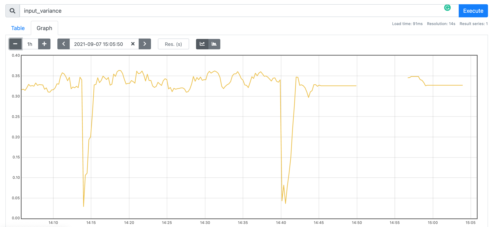

# Monitoring ML systems and application

## Overview
 The goal of this tutorial is to equip the students with basic skills to monitor their real ML systems and applications. Students will study the provided components to monitor ML services. This will involve the monitoring of different layers and corresponding components, such as the infrastructural layer (e.g., VM), the platform layer (e.g., a middleware), and the application layer (such as ML service).

## Basic monitoring tools/frameworks

We will use [Prometheus](https://prometheus.io/) - a very popular open-source monitoring system which is widely used by many companies and organizations for monitoring their applications and infrastructures. Following Prometheus document to study and install main features of Prometheus. Furthermore, we will use [Grafana](https://grafana.com/grafana/download) for performance visualization.

Following the following links to setup Prometheus and Grafana:
* https://prometheus.io/docs/prometheus/latest/getting_started/
* Node Exporter [Download](https://github.com/prometheus/node_exporter/releases/download/v0.18.1/node_exporter-0.18.1.linux-amd64.tar.gz)
* Grafana (used in Node Exporter example) [Download](https://dl.grafana.com/oss/release/grafana-6.6.0.linux-amd64.tar.gz)
* [Configurate Grafana with Prometheus](https://prometheus.io/docs/visualization/grafana/)
* https://dzone.com/articles/monitoring-with-prometheus

## Identifying the goal of monitoring/observability

What is the goal of monitoring? Given an ML service, what would you like to monitor? Can you define high-level metrics that can be determined from low-level monitoring information? Have you considered all the stakeholders' needs for monitoring? Would these metrics satisfy the future needs?

Goal of monitoring/observability must be done together with ML service design, not an after-thought.

## Preparing an ML service

In this tutorial, we would use the BTS ML service that we developed for the ML Project Management tutorial.

Before practicing the monitoring for a machine learning service, we will deploy a simple REST-based machine learning service. We will
* use a [BTS Prediction model]()
* make a simple REST ML service, use [the template and a local version](MLService/)

## Working on low-level monitoring features

In this step, you should work on the list of low-level metrics/data, probes:
* which metrics/ data you are interested in collecting?
* how do the metrics look like and what do you need to collect for the metrics?
* how does the monitoring, observability affect your ML service design?

## Instrumenting ML Service
<!-- >TODO: to be written -->
In this tutorial, we would monitor the [MLService](MLService/) that has been developed in the [MLProjectManagement tutorial](../MLProjectManagement/).
Check the [sample service](MLService/). You can practice to add many metrics as you want.

* test if the ML service work
Start the server
```bash
python server.py
```
and continuously send the request from client
```bash
python client.py
```
In this example, we monitor the input varriance from 50 latest requests sent to the server. In order to achieve that, 50 latest inputs are stored in a buffer, and updated everytime a new request is received on the server. 
```python
buffer = [[0, 0, 0, 0, 0, 0]] * 50
pointer = 0
input_variance = 0
def update_buffer(new_val):
	global buffer
	global pointer
	if pointer < 50:
		buffer[pointer] = new_val
		pointer= pointer + 1
	if pointer >= 50:
		pointer = 0
		buffer[pointer] = new_val
		return buffer

```
The new input varriance is also re-calculated, everytime the server receives a new request.
```python
global input_variance
input =  json.loads(request.form.get('inputs'))
flat_input = np.array(input[0]).flatten()
update_buffer(flat_input)
buffer_np = np.array(buffer)
input_variance = buffer_np.var()
```

### Configure prometheus to monitor the ML Service
If you see the ML service work and the metrics are outputed, then [configure Promethesus to pull metrics](https://prometheus.io/docs/prometheus/latest/configuration/configuration/#scrape_config) from your Prometheus endpoint in your ML service.

* Create `prometheus.yml`
* Create `docker-compose.yaml` file

Inside the `prometheus.yml` file, perform the modifications such as follows:
```properties

scrape_configs:
    - targets: ['localhost:8000', 'localhost:8080']

```
or if you run Prometheus through docker:
```static_configs:
  - targets: ['your_ip_address:8000', 'localhost:8080']
```
Update the `docker-compose.yml` file as follow:
```yml
version: '3'

networks:
  monitor-net:
    driver: bridge

volumes:
    prometheus_data: {}
    grafana_data: {}

services:

  prometheus:
    image: prom/prometheus:latest
    container_name: prometheus
    volumes:
      - /Users/nguyenlinh/Research/cs-e4660/tutorials/PerformanceMonitoring/MLService/prometheus.yml:/etc/prometheus/prometheus.yml
    expose:
      - 9090
    ports:
      - "9090:9090"
    networks:
      - monitor-net
```


Then check the metrics of your ML service in Prometheus/Grafana:
You can do that by searching for the metric on the [Prometheus UI](http://localhost:9090/). This is an example of `input_variance` metric result: 


Also see our [ML serving tutorial](../MLServing/)

## Monitoring computing infrastructures/ML platforms


It is not enough to monitor the ML service without monitoring the underlying infrastructure (e.g., VM, networks, etc.). You can use [Prometheus Exporters](https://prometheus.io/docs/instrumenting/exporters/) and [Push Gateway](https://prometheus.io/docs/instrumenting/pushing/) to do so. However, in this example, we show how you can simply use `psutil` to monitor running process and system utilization:
```bash
pip install psutil
```
Example of using `psutil` to monitor `cpu_percent` and `memory` on server:
```python
@app.route("/metrics")
def log_metric_prometheus():
  metric = 'cpu_percent {}\n'.format(psutil.cpu_percent())
  metric += 'virtual_memory_total {}\n'.format(psutil.virtual_memory()[0])
  metric += 'virtual_memory_percent {}\n'.format(psutil.virtual_memory()[2])
  return metric
``` 

Capture middleware information:
> To be written

## Observing monitoring data, working on high-level metrics, visualization

Check monitoring data of machines, middleware and your ML service.
### Important questions:
* how do you want your monitoring data is visualized?
* 
In this example, we use `Grafana` to visualize our monitoring. In order to config `Grafana`, you can update your `docker-compose.yml`:
```yml
  grafana:
   image: grafana/grafana:latest
   container_name: grafana
   volumes:
     - grafana_data:/var/lib/grafana
     - ./grafana/datasources:/etc/grafana/datasources
     - ./grafana/dashboards:/etc/grafana/dashboards
     - ./grafana/setup.sh:/setup.sh
   environment:
     - GF_SECURITY_ADMIN_USER=${ADMIN_USER:-admin}
     - GF_SECURITY_ADMIN_PASSWORD=${ADMIN_PASSWORD:-admin}
     - GF_USERS_ALLOW_SIGN_UP=false
   restart: unless-stopped
   expose:
     - 3000
   ports:
     - 3000:3000
   networks:
     - monitor-net
```
In order to use `Grafana` to visualize the monitoring data, you need to set the `Prometheus` as a data source. It can be done through **Configuration > Data sources > Add data source**. After that, you can add the visualization through **Create > Dashboard**

## References

* https://github.com/prometheus/client_python
* https://prometheus.io/docs/prometheus/latest/configuration/configuration/#scrape_config
* https://dzone.com/articles/monitoring-with-prometheus
* https://devconnected.com/complete-node-exporter-mastery-with-prometheus
* https://devconnected.com/monitoring-linux-processes-using-prometheus-and-grafana
* https://github.com/rycus86/prometheus_flask_exporter
* https://sysdig.com/blog/prometheus-metrics

## Open Questions

1. How to monitor a machine learning pipeline with Prometheus?

2. How to make an alert for the specific conditions of metrics detected in your machine learning programs or systems with Prometheus?

3. How to monitor multiple nodes or a cluster using Prometheus? What is about the monitoring of a Kubernetes cluster?
