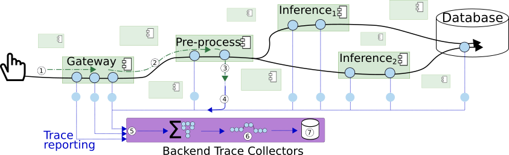
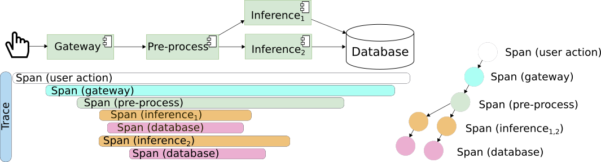

# 02-multi-service-container-tracing

## Study goals
- Give an example for an end-to-end trace setting in service-based applications
  - Instrumentation
    - Lib-based instrumentation
  - Collector
    - receive - process - export
  - Backends of tracing

The traditional setting for a distributed tracing in an example for our ML system as figure:


This work is an example for a manual setting tracing data.


## Assumption for edge-cloud environment setting
- The world network on a single machine
- Services are presented by docker-based containers

## Application
The material from this hand-on is mostly from [Object-classification respository](https://github.com/rdsea/object_classification_v2.git)

## Requirement

### Edit in source code
- We use an object classification application from my colleague or any service-based applications 

- If you use your own application, please carefully check those 
```python

from fastapi import FastAPI, Request
import aiohttp
import logging
from opentelemetry import trace, propagate
from opentelemetry.trace import StatusCode

# --- Exporter imports (use distinct names; do NOT import both into the same name) ---
# HTTP OTLP exporter (sends to collector via HTTP /v1/traces)
from opentelemetry.exporter.otlp.proto.http.trace_exporter import (
    OTLPSpanExporter as OTLPHTTPSpanExporter,
)
# gRPC OTLP exporter (sends to collector via gRPC)
from opentelemetry.exporter.otlp.proto.grpc.trace_exporter import (
    OTLPSpanExporter as OTLPGRPCSpanExporter,
)

# --- SDK components ---
from opentelemetry.sdk.resources import SERVICE_NAME, Resource
from opentelemetry.sdk.trace import TracerProvider
from opentelemetry.sdk.trace.export import BatchSpanProcessor

# --- Instrumentations (don't call .instrument() until after provider installed) ---
from opentelemetry.instrumentation.aiohttp_client import AioHttpClientInstrumentor
from opentelemetry.instrumentation.fastapi import FastAPIInstrumentor

# ---------- Configuration (tweak these per environment) ----------
SERVICE_NAME_VALUE = "my-fastapi-service"  # change me
# Prefer using env var OTEL_EXPORTER_OTLP_ENDPOINT in production, but show inline here:
OTLP_HTTP_ENDPOINT = "http://otel-collector:4318/v1/traces"  # use collector host in your network
OTLP_GRPC_ENDPOINT = "otel-collector:4317"                   # if you prefer gRPC

# ---------- 1) Create Resource (service metadata) ----------
# Service name is required by most backends and appears in UIs.
resource = Resource(attributes={
    SERVICE_NAME: SERVICE_NAME_VALUE,
    "service.version": "0.1.0",               # optional
    "deployment.environment": "development",  # optional
})

# ---------- 2) Create TracerProvider with the Resource ----------
# Install provider *before* calling any instrumentations.
trace_provider = TracerProvider(resource=resource)
# (We will set the provider as global below after adding processors.)

# ---------- 3) Choose and create an exporter ----------
# Pick one exporter type (HTTP or gRPC). Don't instantiate both unless you know what you're doing.
# HTTP exporter (use endpoint like http://COLLECTOR:4318/v1/traces)
otlp_exporter = OTLPHTTPSpanExporter(endpoint=OTLP_HTTP_ENDPOINT)

# If you prefer gRPC, use:
# otlp_exporter = OTLPGRPCSpanExporter(endpoint=OTLP_GRPC_ENDPOINT)

# ---------- 4) Create and attach a BatchSpanProcessor ----------
# BatchSpanProcessor is recommended for production (buffers & sends asynchronously).
span_processor = BatchSpanProcessor(
    otlp_exporter,
    # optional tuning:
    # max_queue_size=2048,
    # schedule_delay_millis=500,   # how often to send batches (ms)
    # exporter_timeout_millis=30000,
)
trace_provider.add_span_processor(span_processor)

# ---------- 5) Install the global provider ----------
trace.set_tracer_provider(trace_provider)

# ---------- 6) Now instrument libraries (they will pick up the installed provider) ----------
# Instrument aiohttp client (auto-creates client spans for outgoing HTTP calls)
AioHttpClientInstrumentor().instrument()
# Instrument FastAPI app later after app creation (below)

# ---------- 7) Create the app and instrument it ----------
app = FastAPI()
FastAPIInstrumentor.instrument_app(app, exclude_spans=["send", "receive"])
# exclude_spans = avoid noisy low-level framework spans; adjust if you want more detail

# ---------- 8) Get a tracer for manual spans ----------
tracer = trace.get_tracer(__name__)


############# 
from opentelemetry import trace

from opentelemetry.exporter.otlp.proto.http.trace_exporter import OTLPSpanExporter
from opentelemetry.exporter.otlp.proto.grpc.trace_exporter import OTLPSpanExporter


from opentelemetry.sdk.resources import SERVICE_NAME, Resource
from opentelemetry.sdk.trace import TracerProvider
from opentelemetry.sdk.trace.export import BatchSpanProcessor

from opentelemetry.instrumentation.aiohttp_client import AioHttpClientInstrumentor
AioHttpClientInstrumentor().instrument()

# Service name is required for most backends
# Define RESOURCE
resource = Resource(attributes={SERVICE_NAME: "NAME_YOUR_SERVICE"})
trace_provider = TracerProvider(resource=resource)
# Define EXPORTER
otlp_exporter = OTLPSpanExporter(endpoint="http://localhost:4318/v1/traces")
# Define PROCESSOR
processor = BatchSpanProcessor(otlp_exporter)
trace_provider.add_span_processor(processor)

trace.set_tracer_provider(trace_provider)

tracer = trace.get_tracer(__name__)

app = FastAPI()
# instrumentation Lib
from opentelemetry.instrumentation.fastapi import FastAPIInstrumentor

FastAPIInstrumentor.instrument_app(app, exclude_spans=["send", "receive"])
```

- Specify process if really want
```python
provider.add_span_processor(
    BatchSpanProcessor(
        otlp_exporter,
        max_export_batch_size=5,
        schedule_delay_millis=1000,  # 1 second
    )
)

```

### Collector and Tracing backends

#### Single Jaeger runs as the collector and tracing backend of the trace data
- **Jaeger**
```bash
docker run --rm --name jaeger \
  -p 16686:16686 \
  cr.jaegertracing.io/jaegertracing/jaeger:2.9.0
```

<!-- NOTE: --> NOTE: remember to connect jaeger to the network of the docker-compose 
> docker network connect deployment_default jaeger

#### Collector with Otel and tracing backend with Jaeger
- **Otel-Collector and Jaeger**

```bash
# Jaeger
docker run --rm --name jaeger  \
  -e COLLECTOR_OTLP_ENABLED=true \
  -p 16686:16686 \
  cr.jaegertracing.io/jaegertracing/jaeger:2.9.0

# OpenTelemetry Collector
docker run --rm --name otelcol  \
  -v "./config/otel-collector-config.yaml":/etc/otelcol-contrib/config.yaml \
  otel/opentelemetry-collector-contrib:0.133.0 \
  --config /etc/otelcol-contrib/config.yaml

```
<!-- NOTE: --> NOTE: remember to connect jaeger to the network of the docker-compose 
> docker network connect deployment_default jaeger

> docker network connect deployment_default otelcol

#### Test
- run this script at image/ to load image before sending to preprocessing service

> python client_processing.py --url http://preprocessing:5010/preprocessing

## Further investigation
- How can you extension this tutorial to further various 
