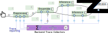
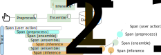

# 02-multi-service-container-tracing

## Study Goals
This tutorial will guide you through setting up end-to-end tracing for a distributed, multi-service application. You will learn how to:
- Use Docker Compose to run a multi-container application.
- Configure microservices to send traces to Jaeger, a distributed tracing backend.
- Generate load and visualize the resulting traces in the Jaeger UI.
- (Optional) Introduce an OpenTelemetry Collector into your setup to receive, process, and export telemetry data.

## Prerequisites
- Docker and Docker Compose
- Python 3.8+ (for the load generator)

## Application Architecture
The application is a simplified machine learning system for object classification, consisting of four services:
- `preprocessing`: Receives an image and prepares it for the model.
- `ensemble`: Manages the different inference models.
- `efficientnetb0` & `mobilenetv2`: Two different models for performing inference.

These services are containerized and defined in `deployment/docker-compose.yaml`. They are already instrumented with OpenTelemetry.

The overall architecture is depicted below:


## Hands-on Steps

### Part 1: Running the Application with Jaeger
In this part, we will run the application and have all services send traces directly to Jaeger.

1. **Review the Docker Compose setup:**
   The `application/docker-compose.yaml` file has been set up to run all the service-based application. By default, the application services are configured to send traces directly to the Jaeger container (`http://jaeger:4318`).

2. **Start the application:**
   Open a terminal and run the following command from the `02-multi-service-container-tracing` directory:
   ```bash
   docker compose -f application/docker-compose.yaml up -d
   ```
   This will start all the service-based application in the background.

3. **Start Jaeger to collect spans**
   ```bash
   docker run --rm --name jaeger \
     -p 16686:16686 \
     -p 4317:4317 \
     -p 4318:4318 \
     cr.jaegertracing.io/jaegertracing/jaeger:2.9.0
   #cr.jaegertracing.io/jaegertracing/all-in-one:latest
   ```

4. **Generate load:**
   The `application/loadgen` directory contains a script to send requests to the application.

   a. **Create a virtual environment and install dependencies:**
      ```bash
      cd application/loadgen
      python -m venv venv
      source venv/bin/activate
      pip install requests numpy pillow PyYAML aiohttp locust
      ```

   b. **Run the load generator:**
      The following command will send an image to the `preprocessing` service.
      ```bash
      python client_processing.py --url http://localhost:5010/preprocessing --ds_path ../../image
      ```

5. **Observe traces in Jaeger:**
   Open your web browser and navigate to `http://localhost:16686`. You should see the Jaeger UI. In the "Service" dropdown, you should find the services from our application (e.g., `preprocessing`, `ensemble`). Select one and click "Find Traces" to see the distributed traces.

   

### Part 2 (Optional): Introducing the OpenTelemetry Collector
It is a best practice to use an OpenTelemetry Collector to manage telemetry data. The provided `docker-compose.yaml` also includes an `otelcol` service.

1. **Switch the exporter endpoint:**
   To use the collector, we need to tell the application services to send traces to the `otelcol` container instead of `jaeger`.

   Stop the running services and restart them with the `OTEL_EXPORTER_OTLP_ENDPOINT` environment variable set to the collector's address:
   ```bash
   # Stop the services
   docker compose -f deployment/otel-jaeger.yaml up -d

   # Restart with the application docker compose with different endpoint
   OTEL_ENDPOINT="http://otelcol:4318/v1/traces" 

   docker-compose -f application/docker-compose.yaml up -d
   ```

2. **Generate load and observe traces:**
   Run the load generator again as in Part 1. The traces will now flow from the application services to the OpenTelemetry Collector, and then be exported to Jaeger. You can view them in the Jaeger UI as before.

## Cleanup
To stop and remove all the containers, run:
```bash
docker-compose -f deployment/docker-compose.yaml down
```
