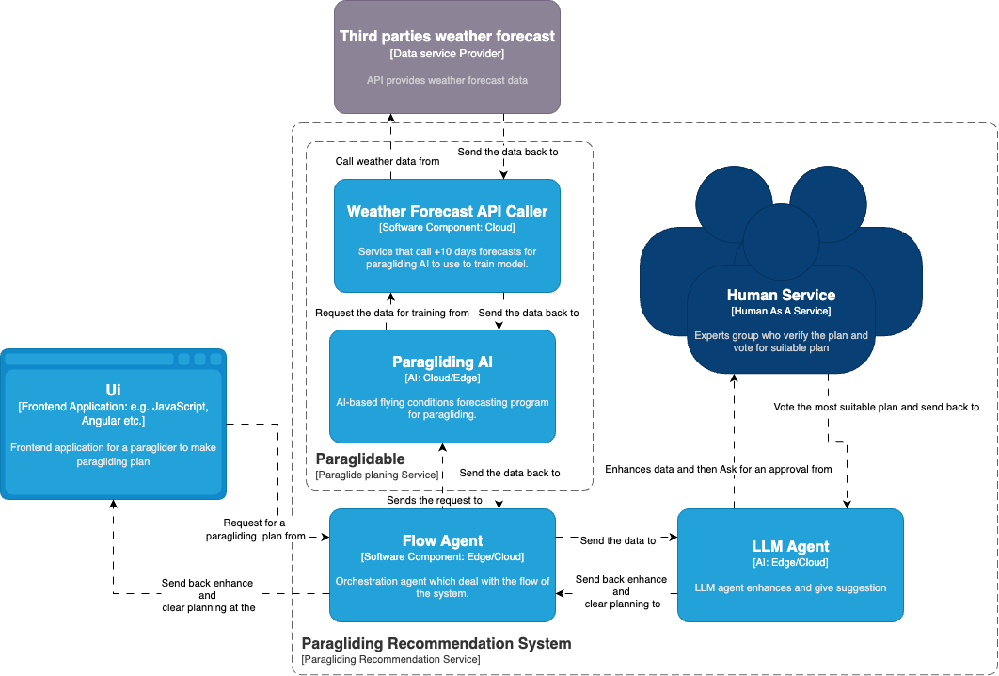
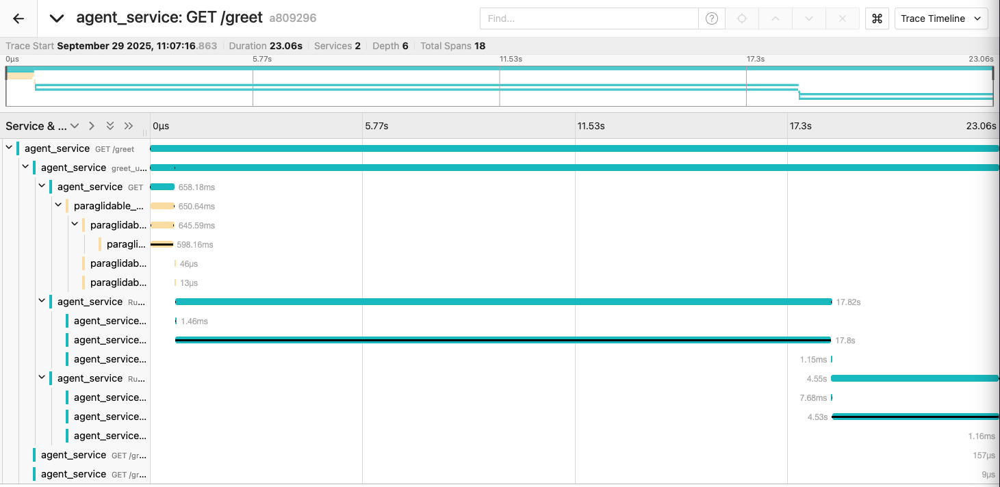
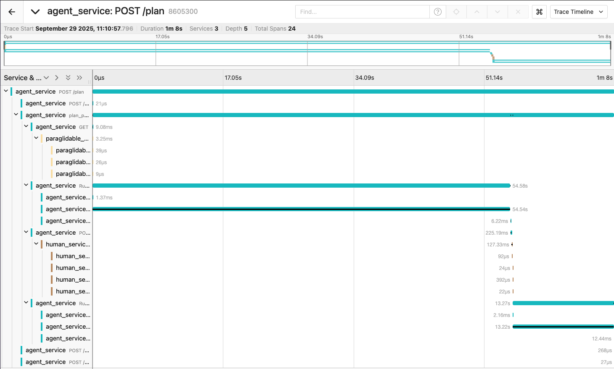
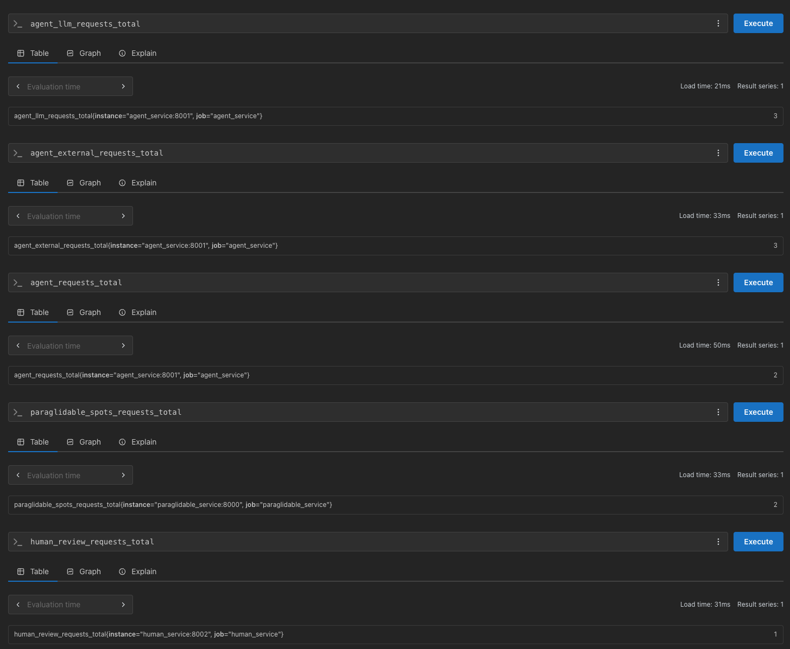
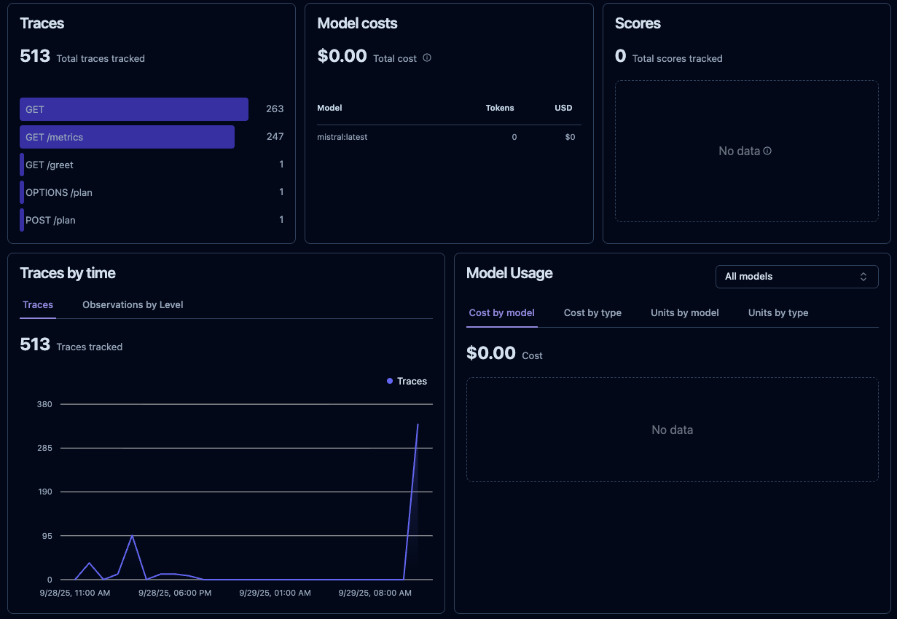

# Hands-on Tutorial: Observability in term of Robustness for HIS-LLM in Multi continuum Computing

## Study goal
The purpose of this hands-on tutorial is to learn:
- Implementing observability in Hybrid Intelligence Software with LLMs (HIS-LLM) across the edge–cloud continuum.

- Be able to capture robustness metrics of HIS-LLM services in real-time, supporting context-aware runtime explainability.

Observability of HIS-LLM pipelines is essential for ensuring trustworthiness in multi-continuum environments. Robustness such as adaptability to natural perturbations, stability under noisy inputs, and fairness across heterogeneous conditions provide insights into how well the system performs under uncertainty.

Monitoring these metrics enables continuous evaluation and improvement of HIS-LLM, ensuring that interactions across humans, AI components, and infrastructure remain reliable over time. Furthermore, observability helps in detecting degradation, unexpected behaviors, and vulnerabilities, which are critical for maintaining robustness and explainability in end-to-end HIS-LLM deployments.

## Prerequisite
* [Docker](https://docs.docker.com/get-docker/)
* [OLLAMA](https://ollama.com/) (for local LLM inference)

## Scenario: Paragliding Trip Planning in HIS-LLM
In this tutorial, we will learn how to evaluate robustness in a multi-continuum HIS-LLM system using a software application that helps a user plan a paragliding trip. The HIS-LLM workflow for paragliding trip planning illustrates a multi-continuum architecture, where computation and decision-making occur across:

1. **AI (Cloud/Edge):** 
    - LLM agent(agent_service) coordinates reasoning and integrates external services.
    - Paragliding AI (paraglidable_service) → Evaluates suitability of sites based on terrain & safety rules.

**How we emulate the multi-continuum:**
- The agent_service runs in the cloud (simulated by local Docker container).
- The paraglidable_service runs on the cloud (retrieved as API call) and makes it accessible for the agent_service.

2. **Data Service (Cloud APIs):** 
    - weather_service → Retrieves forecasts (wind speed, visibility, precipitation) as a integrated with paraglidable_service.

**How we emulate the multi-continuum:**
- The weather_service runs on the cloud integrated with the paraglidable_service.

3. **Human (Crowdsourced Experts):** Human-as-a-Service contributes review, validation, and approval.

**How we emulate the multi-continuum:**
- The human_service runs in the cloud (simulated by local Docker container).

This layered interaction ensures hybrid intelligence by combining automated reasoning with human judgment and distributed data sources.

## Observability in term of Robustness:

### What will be focus:

How to monitor and quantify robustness in this HIS-LLM system across the edge-cloud continuum and using those to aggregate determine the robustness of HIS-LLM system.



## Build a containerized application
1. Clone this tutorial repository if you haven't already and navigate into it:
    ```bash
    git clone <repository-url>
    cd <repository-name>
    ```
2. Clone Langfuse repository for detailed LLM interaction logging:
    ```bash
    git clone https://github.com/langfuse/langfuse.git
    cd langfuse
    docker-compose up
    ```
    This will start Langfuse server on port `3000`. You can access the Langfuse UI at `http://localhost:3000` in your web browser.
    Then follow the instructions to create an account and get your public and secret keys. In a self-hosted Langfuse environment, the `LANGFUSE_PUBLIC_KEY` and `LANGFUSE_SECRET_KEY` are project-specific and can be retrieved from the Langfuse dashboard under the Project —> Settings page.

3. Get Paraglidable API key from [Paraglidable](https://www.paraglidable.com). Try to choose the spot from the same country as a group of spots (e.g., Switzerland) to ensure the agent can find suitable locations. 
- 1) Place spots
        - Click on the map to add a spot
        - Click on a spot to change its name or remove it
- 2) Get the key
    - After placing the spots, you can retrieve the API key from the Paraglidable by giving your email address to the textbox below.

4. Set Environment Variables: Create a `.env` file in the root directory with the following content (replace placeholders with your actual keys):
    ```env
    # Praglidable API key
    PARAGLIDABLE_KEY= your_paraglidable_api_key_here

    # Global OTEL config
    OTEL_EXPORTER_OTLP_PROTOCOL_HTTP=http/protobuf
    OTEL_EXPORTER_OTLP_PROTOCOL_GRPC=grpc
    OTEL_EXPORTER_OTLP_ENDPOINT_HTTP=http://otel-collector:4318/v1/traces
    OTEL_EXPORTER_OTLP_ENDPOINT_GRPC=otel-collector:4317

    # Service-specific OTEL names
    PARAGLIDABLE_OTEL_SERVICE_NAME=paraglidable_service
    HUMAN_OTEL_SERVICE_NAME=human_service
    AGENT_OTEL_SERVICE_NAME=agent_service
    FRONTEND_OTEL_SERVICE_NAME=frontend_service

    # Ollama config
    OLLAMA_HOST=host.docker.internal
    OLLAMA_PORT=11434
    OLLAMA_MODEL= your_ollama_model_here

    PARAGLIDABLE_SERVICE_API_URL=http://paraglidable_service:8000/spots
    HUMAN_SERVICE_API_URL=http://human_service:8002/review

    LANGFUSE_PUBLIC_KEY= your_langfuse_public_key_here
    LANGFUSE_SECRET_KEY= your_langfuse_secret_key_here
    LANGFUSE_HOST=http://host.docker.internal:3000
    ```
2. Build and Start Services: The repository contains separate folders for each service (agent_service/, paraglidable_service/, human_service/, frontend_service/). Each has a FastAPI app, a Dockerfile, and a requirements.txt.
To build and start all services, run:
    ```bash
    docker compose -f docker-compose.his.yml up --build
    ```
This will start all the services defined in the `docker-compose.yml` file:
- paraglidable_service on port `8000`
- agent_service on port `8001`
- human_service on port `8002`
- frontend_service on port `3100`

You can access the frontend application at `http://localhost:3100` in your web browser and then test the functionality, such as submitting a paragliding request.

# Observability
In this tutorial, observability is structured around a holistic view of interactions in the HIS-LLM system. Instead of focusing on separate monitoring dimensions, we analyze ``interaction metrics and patterns`` to understand system behavior and robustness.

These are the tools that we will use:
- **Tracing:** OpenTelemetry (OTEL) with Jaeger backend to trace requests across services
- **Metrics:** Prometheus for collecting and storing metrics, Grafana for visualization
- **LLM Interaction Logging:** Langfuse for detailed logging of LLM interactions and decisions

## 1. Set up Observability
### - agent_service
```python
# OpenTelemetry imports
from opentelemetry import trace, metrics
from opentelemetry.sdk.resources import Resource
from opentelemetry.sdk.trace import TracerProvider
from opentelemetry.sdk.trace.export import BatchSpanProcessor
from opentelemetry.exporter.otlp.proto.grpc.trace_exporter import OTLPSpanExporter
from opentelemetry.instrumentation.fastapi import FastAPIInstrumentor
from opentelemetry.instrumentation.requests import RequestsInstrumentor
from opentelemetry.instrumentation.aiohttp_client import AioHttpClientInstrumentor
import aiohttp
# Prometheus metrics
from opentelemetry.exporter.prometheus import PrometheusMetricReader
from opentelemetry.sdk.metrics import MeterProvider
# Mount /metrics endpoint
from starlette.middleware.wsgi import WSGIMiddleware
from prometheus_client import make_asgi_app
# Langfuse imports
from langfuse import Langfuse
from langfuse.langchain import CallbackHandler
from langfuse import get_client

# OTEL environment variables
OTEL_ENDPOINT = os.getenv("OTEL_EXPORTER_OTLP_ENDPOINT_GRPC")
SERVICE_NAME = os.getenv("AGENT_OTEL_SERVICE_NAME")
# --------------------------
# OpenTelemetry Tracing Setup
# --------------------------
AioHttpClientInstrumentor().instrument()
resource = Resource(attributes={"service.name": SERVICE_NAME})
tracer_provider = TracerProvider(resource=resource)
span_processor = BatchSpanProcessor(
    OTLPSpanExporter(endpoint=OTEL_ENDPOINT, insecure=True)
)
tracer_provider.add_span_processor(span_processor)
trace.set_tracer_provider(tracer_provider)
tracer = trace.get_tracer(__name__)
# --------------------------
# OpenTelemetry Metrics Setup
# --------------------------
metric_reader = PrometheusMetricReader()
meter_provider = MeterProvider(metric_readers=[metric_reader])
metrics.set_meter_provider(meter_provider)
meter = metrics.get_meter(SERVICE_NAME)

# Create example metrics
request_counter = meter.create_counter(
    "agent_requests_total",
    description="Total requests handled by the agent service"
)

llm_request_counter = meter.create_counter(
    "agent_llm_requests_total",
    description="Total LLM calls from agent service"
)

external_service_counter = meter.create_counter(
    "agent_external_requests_total",
    description="Total requests to external services"
)

# Initialize Langfuse
langfuse = Langfuse(
    public_key=os.getenv("LANGFUSE_PUBLIC_KEY"),
    secret_key=os.getenv("LANGFUSE_SECRET_KEY"),
    host=os.getenv("LANGFUSE_HOST")
) 
langfuse = get_client()
 
# Verify connection, do not use in production as this is a synchronous call
if langfuse.auth_check():
    print("Langfuse client is authenticated and ready!")
else:
    print("Authentication failed. Please check your credentials and host.")
# Create Langfuse callback handler
langfuse_handler = CallbackHandler()
```

### - human_service
```python
# OpenTelemetry imports
from opentelemetry import trace, metrics
from opentelemetry.sdk.resources import Resource
from opentelemetry.sdk.trace import TracerProvider
from opentelemetry.sdk.trace.export import BatchSpanProcessor
from opentelemetry.exporter.otlp.proto.grpc.trace_exporter import OTLPSpanExporter
from opentelemetry.instrumentation.fastapi import FastAPIInstrumentor
from opentelemetry.instrumentation.requests import RequestsInstrumentor

# Prometheus metrics
from opentelemetry.exporter.prometheus import PrometheusMetricReader
from opentelemetry.sdk.metrics import MeterProvider, Counter
# Mount /metrics endpoint
from starlette.middleware.wsgi import WSGIMiddleware
from prometheus_client import make_asgi_app

# Load environment variables
load_dotenv()
OTEL_ENDPOINT = os.getenv("OTEL_EXPORTER_OTLP_ENDPOINT_GRPC")
SERVICE_NAME = os.getenv("HUMAN_OTEL_SERVICE_NAME")

# Configure OTEL Tracing (gRPC)
resource = Resource(attributes={"service.name": SERVICE_NAME})
tracer_provider = TracerProvider(resource=resource)
processor = BatchSpanProcessor(
    OTLPSpanExporter(endpoint=OTEL_ENDPOINT, insecure=True)
)
tracer_provider.add_span_processor(processor)
trace.set_tracer_provider(tracer_provider)
tracer = trace.get_tracer(__name__)

# Configure OTEL Metrics (Prometheus)
metric_reader = PrometheusMetricReader()
meter_provider = MeterProvider(metric_readers=[metric_reader], resource=resource)
metrics.set_meter_provider(meter_provider)
meter = metrics.get_meter(__name__)

# Define a counter for review requests
review_counter = meter.create_counter(
    name="human_review_requests_total",
    description="Total number of human review requests",
    unit="1"
)
```

### - paraglidable_service
```python
# OpenTelemetry imports
from opentelemetry import trace, metrics
from opentelemetry.sdk.resources import Resource
from opentelemetry.sdk.trace import TracerProvider
from opentelemetry.sdk.trace.export import BatchSpanProcessor
from opentelemetry.exporter.otlp.proto.grpc.trace_exporter import OTLPSpanExporter
from opentelemetry.instrumentation.fastapi import FastAPIInstrumentor
from opentelemetry.instrumentation.requests import RequestsInstrumentor
from opentelemetry.instrumentation.aiohttp_client import AioHttpClientInstrumentor
import aiohttp
# Prometheus metrics
from opentelemetry.exporter.prometheus import PrometheusMetricReader
from opentelemetry.sdk.metrics import MeterProvider, Counter
# Mount /metrics endpoint
from starlette.middleware.wsgi import WSGIMiddleware
from prometheus_client import make_asgi_app

# Load environment variables
load_dotenv()
OTEL_ENDPOINT = os.getenv("OTEL_EXPORTER_OTLP_ENDPOINT_GRPC")
SERVICE_NAME = os.getenv("PARAGLIDABLE_OTEL_SERVICE_NAME")
PARAGLIDABLE_KEY = os.getenv("PARAGLIDABLE_KEY")

# Configure OTEL Tracing (gRPC)
resource = Resource(attributes={"service.name": SERVICE_NAME})
tracer_provider = TracerProvider(resource=resource)
processor = BatchSpanProcessor(
    OTLPSpanExporter(endpoint=OTEL_ENDPOINT, insecure=True)
)
tracer_provider.add_span_processor(processor)
trace.set_tracer_provider(tracer_provider)
tracer = trace.get_tracer(__name__)
AioHttpClientInstrumentor().instrument()

# Configure OTEL Metrics (Prometheus)
metric_reader = PrometheusMetricReader()
meter_provider = MeterProvider(metric_readers=[metric_reader], resource=resource)
metrics.set_meter_provider(meter_provider)
meter = metrics.get_meter(__name__)

# Counter for number of /spots calls
spots_counter = meter.create_counter(
    name="paraglidable_spots_requests_total",
    description="Total number of /spots requests",
)
```

## 2. Instrument the observability in the code:
Here are examples of how to instrument tracing and metrics in the code for each service. (Note: Here is just examples for explanatory purposes. The actual code is already implemented in the respective service files.)
### - agent_service
```python
# Add these metrics increment in the relevant places in the code, for example:
# Example of incrementing the counters
request_counter.add(1)  # Increment metric 
llm_request_counter.add(1)  # Increment metric
external_service_counter.add(1)  # Increment metric

# For tracing, wrap key functions or request handlers example:

with tracer.start_as_current_span("fetch_spots", kind=trace.SpanKind.INTERNAL) as fetch_spots_span:
    fetch_spots_span.set_attribute("interaction_type", "S2S")
    ...
```

### - human_service
```python
# Add these metrics increment in the relevant places in the code, for example:
# Example of incrementing the counters
review_counter.add(1)

# For tracing, wrap key functions or request handlers example:
tracer.start_as_current_span(f"vote_by_{e}") as vote_span:
                # Mark this sub-span as H2S as well
    vote_span.set_attribute("interaction_type","H2S")
    ... 
```

### - paraglidable_service
```python
# Add these metrics increment in the relevant places in the code, for example:
# Example of incrementing the counters
spots_counter.add(1)

# For tracing, wrap key functions or request handlers example:
tracer.start_as_current_span("get_spots") as fetch_span:
        fetch_span.set_attribute("interaction_type", "S2S")    
```

## 3. Visualize Observability Data

### - Tracing Visualization
Example of tracing and metrics visualization:
#### - /greet endpoint in agent_service


#### - /plan endpoint in agent_service


#### - Prometheus Metrics Visualization


#### - Langfuse Visualization


## 4. Analyze Interaction Metrics for Robustness based on the tracing data
We create a script `hisllm_analytics.py` to analyze the tracing data and extract interaction metrics. The script fetches traces from Jaeger, processes them to identify interaction types (H2S, S2S, H2H).

Example of how to run the script:
```bash
python hisllm_analytics.py --services=agent_service,human_service,paraglidable_service --jaeger-api=http://localhost:16686/api/traces --feature=summary_interactions
```
- services: Comma-separated list of service names to include in the analysis.
- jaeger-api: URL of the Jaeger API endpoint to fetch traces from.
- feature: The type of analysis to perform. Currently supports "per_service_interactions", "summary_interactions", "interaction_counts", "detailed_trace_table".

example output of the script:
```bash
python hisllm_analytics.py --services=agent_service,human_service,paraglidable_service --jaeger-api=http://localhost:16686/api/traces --feature=summary_interactions

Aggregated interaction summary:
+--------------------+---------+---------------------+
| Interaction Type   |   Count |   Avg Duration (ms) |
+====================+=========+=====================+
| S2S                |      17 |              11.564 |
+--------------------+---------+---------------------+
| H2S                |      19 |              10.301 |
+--------------------+---------+---------------------+
| H2H                |       0 |               0     |
+--------------------+---------+---------------------+
```
From there we can see what are the interactions happening in the system and how many times they are happening. This can give us insights into the robustness of the system. We can see if there are any bottlenecks or failures in the interactions or we can see what are the most common interactions happening in the system; what is our system is relying on the most H2S, S2S, or H2H.

## 5. Next Steps
You can try to simulate diffrerent scenarios to see how the system behaves and how the interaction metrics change. For example, you can try to:
- Introduce more load to the system 
- Introduce some error with the agent_service
- Introduce latency in the paraglidable_service or human_service
- Introduce errors in the paraglidable_service or human_service
- Change the LLM model in the agent_service
- Add more services to the system
- Change the user input. Here are some examples of robustness testing:
    - **Robustness from Natural Perturbations**
        - Example of robustness testing with varied user inputs
        Test sensitivity to variations in phrasing, casing, and sentence structure:

        **Test Inputs:**  
        1. Where should I go paragliding in Switzerland next weekend?  
        2. Where should I go paragliding in Switzerland next weekend  
        3. Where should I go paragliding in Switzerland next weekend?  
        4. WHERE SHOULD I GO PARAGLIDING IN SWITZERLAND NEXT WEEKEND?  
        5. Can you suggest where I should go paragliding in Switzerland next weekend?  
        6. Any recommendations for paragliding in Switzerland next weekend?  
        7. Where could I go for paragliding in Switzerland next weekend?  
        8. Where should I plan to go paragliding in Switzerland next weekend?  
        9. Where is a good place to paraglide in Switzerland next weekend?  
        10. I want to go paragliding in Switzerland next weekend — where should I go?  

        **Expected Output:**  
        - "Based on the current weather conditions and paragliding site data, I recommend going to [Site Name] in Switzerland next weekend."

    - **Robustness from Out-of-Scope Requests**
        - Example of robustness testing with varied user inputs
            - To assess how well the `agent_service` handles inputs outside its knowledge domain (only Swiss paragliding sites are available):

            **Test Inputs:**  
            - "Where should I go paragliding in California next weekend?"  
            - "Is it safe to paraglide in the Alps in July?"  

            **Expected Output:**  
            - "I can only provide paragliding recommendations for sites in Switzerland. Please specify a location within Switzerland."  
---
## Open questions
- How about multi-modal inputs (e.g., text + images)?
- How about multi-agent systems?

## References
- [Paraglidable](https://github.com/AntoineMeler/Paraglidable)
- [OpenTelemetry](https://opentelemetry.io/)
- [Prometheus](https://prometheus.io/)
- [Jaeger](https://www.jaegertracing.io/)
- [Grafana](https://grafana.com/)
- [Langfuse Documentation](https://docs.langfuse.com/)
