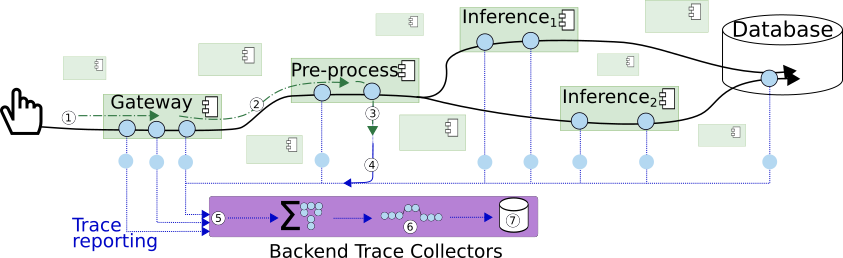

# Tracing service-based system on Edge environment

## Goal
- This observability focuses on tracing

The traditional setting for a distributed tracing in an example for our ML system as figure:


This work is an example for a manual setting tracing data.


- Do we want to have analysis

## reflect edge and cloud setting env 
- What is the edge? -- concept for the edge
     - emulate via docker containers
- Edge:
     - List of single machines
- Cloud:
      - K8s-based cluster -- minikube to emulate this 
## Requirement

### Application
- We use an object classification application from my colleague or any service-based applications 

- If you use your own application, please carefully check those 
```python
from opentelemetry import trace

from opentelemetry.exporter.otlp.proto.http.trace_exporter import OTLPSpanExporter
from opentelemetry.exporter.otlp.proto.grpc.trace_exporter import OTLPSpanExporter


from opentelemetry.sdk.resources import SERVICE_NAME, Resource
from opentelemetry.sdk.trace import TracerProvider
from opentelemetry.sdk.trace.export import BatchSpanProcessor

from opentelemetry.instrumentation.aiohttp_client import AioHttpClientInstrumentor
AioHttpClientInstrumentor().instrument()

# Service name is required for most backends
# Define RESOURCE
resource = Resource(attributes={SERVICE_NAME: "NAME_YOUR_SERVICE"})
trace_provider = TracerProvider(resource=resource)
# Define EXPORTER
otlp_exporter = OTLPSpanExporter(endpoint="http://localhost:4318/v1/traces")
# Define PROCESSOR
processor = BatchSpanProcessor(otlp_exporter)
trace_provider.add_span_processor(processor)

trace.set_tracer_provider(trace_provider)

tracer = trace.get_tracer(__name__)

app = FastAPI()
# instrumentation Lib
from opentelemetry.instrumentation.fastapi import FastAPIInstrumentor

FastAPIInstrumentor.instrument_app(app, exclude_spans=["send", "receive"])
```

- Specify process if really want
```python
provider.add_span_processor(
    BatchSpanProcessor(
        otlp_exporter,
        max_export_batch_size=5,
        schedule_delay_millis=1000,  # 1 second
    )
)

```

### Collector

- **Jaeger**
```bash
docker run --rm --name jaeger \
  -p 16686:16686 \
  cr.jaegertracing.io/jaegertracing/jaeger:2.9.0
```

<!-- NOTE: --> NOTE: remember to connect jaeger to the network of the docker-compose 
> docker network connect deployment_default jaeger
- **Otel-Collector and Jaeger**

```bash
# Jaeger
docker run --rm --name jaeger  \
  -e COLLECTOR_OTLP_ENABLED=true \
  -p 16686:16686 \
  cr.jaegertracing.io/jaegertracing/jaeger:2.9.0

# OpenTelemetry Collector
docker run --rm --name otelcol  \
  -v "./config/otel-collector-config.yaml":/etc/otelcol-contrib/config.yaml \
  otel/opentelemetry-collector-contrib:0.133.0 \
  --config /etc/otelcol-contrib/config.yaml
```
<!-- NOTE: --> NOTE: remember to connect jaeger to the network of the docker-compose 
> docker network connect deployment_default jaeger

> docker network connect deployment_default otelcol

#### Test

> python client_processing.py --url http://preprocessing:5010/preprocessing

## Further investigation
- How can you extension this tutorial to further various 
